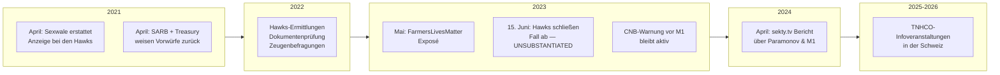
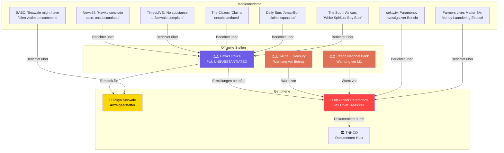
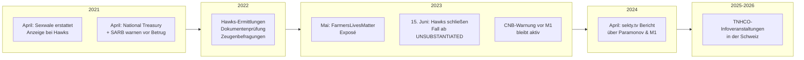

# Ermittlungen & Warnungen — White Spiritual Boy / M1 / TNHCO

> **Stand:** 2026-07-01 | **Quellen:** Südafrikanische Medien, Behörden, Zentralbanken, FINMA  
> **Verlinkte Dokumente:** [Hauptrecherche](WHITE_SPIRITUAL_BOY_RESEARCH.md) · [Organigramm](ORGANIGRAMM_VERFLECHTUNGEN.md) · [Glaubwürdigkeit TNHCO](GLAUBWUERDIGKEIT_TNHCO.md) · [Personen & Verflechtungen](PERSONEN_VERFLECHTUNGEN.md) · [TNHCO Archiv](../markdown/) · [Übersetzungen](../markdown_de/)

---

## 📌 Übersicht der Verfahren & Warnungen

Es gibt **vier dokumentierte offizielle Reaktionen** von staatlichen Stellen auf das White-Spiritual-Boy/M1/TNHCO-Netzwerk:

| # | Behörde | Land | Datum | Aktion | Status |
|---|---------|------|-------|--------|--------|
| 1 | **Hawks** (Priority Crime Unit) | 🇿🇦 Südafrika | 2021–2023 | Ermittlung zu Diebstahl-Vorwürfen | ✅ Abgeschlossen (unsubstantiiert) |
| 2 | **National Treasury + SARB** | 🇿🇦 Südafrika | 19.04.2021 | Joint Media Statement | ⚠️ Warnung vor Betrug |
| 3 | **Česká národní banka (CNB)** | 🇨🇿 Tschechien | k.A. | Offizielle Warnung vor M1 | ⚠️ Aktiv |
| 4 | **FINMA** (Finanzmarktaufsicht) | 🇨🇭 Schweiz | 04.02.2025 | Warnliste: unbewilligte Tätigkeit | 🚨 AKTIV — laufende Ermittlungen |

---

## 🔍 1. Hawks-Ermittlung: "White Spiritual Boy Trust"

### Details

**Tokyo Sexwale** (*1953*) ist ein prominenter südafrikanischer Politiker:
- ANC-Veteran, Anti-Apartheid-Aktivist (Robben Island mit Mandela)
- Ehemaliger Premier von Gauteng (1994–1999)
- Ehemaliger Minister für Human Settlements (2009–2013)
- Geschäftsmann, Multimillionär
- Kandidierte 2017 für den FIFA-Präsidentenposten

**Seine Behauptungen (2021):**
- Ein angeblicher **"Heritage Fund"** / **"White Spiritual Boy Trust"** sei von einem ausländischen Spender eingerichtet worden
- Der Fonds sollte **kostenlose Bildung** und **COVID-19-Hilfe** finanzieren
- **Milliarden Rand** seien daraus gestohlen worden
- Das Geld sei in **privaten Konten bei der South African Reserve Bank (SARB)** deponiert gewesen
- Es sei unrechtmäßig auf **sechs Konten von Geschäftsbanken und Privatpersonen** transferiert worden

**Ergebnis der Hawks-Ermittlung (15.06.2023):**
> *"Let me also indicate that the case of White Spiritual Boy Trust … has now been concluded with the allegations unsubstantiated."*  
> — **General Godfrey Lebeya**, Hawks National Head

Die Ermittler fanden **keinerlei Beweise** für die Existenz des angeblichen Trusts oder die behaupteten Transaktionen.

---

## 🏛️ 2. National Treasury + SARB: Joint Media Statement (2021)

Am **19. April 2021** veröffentlichten das **südafrikanische Finanzministerium** und die **South African Reserve Bank** eine gemeinsame Erklärung:

> *"National Treasury and the SARB have previously received correspondence from Mr Sexwale and many others that alleges that billions of rands have been stolen from a fund that has been referred to as the 'White Spiritual Boy Trust' and which was set up by a foreign donor. It is further alleged that there are trillions of dollars in the said fund..."*

**Kernaussagen der Behörden:**
1. Es gibt **keinerlei Beweise** für die Existenz des "White Spiritual Boy Trust"
2. Die Behauptungen über Billionen-Dollar-Guthaben sind **haltlos**
3. Personen, die Zahlungen für angebliche Zugangsgebühren zu diesem Fonds leisten, werden vor **Betrug gewarnt**
4. Die SARB stellt klar: Keine solchen Konten existieren im südafrikanischen Bankensystem

📄 **Quelle:** [treasury.gov.za — Joint Media Statement (PDF)](https://www.treasury.gov.za/comm_media/press/2021/2021041901%20NATIONAL%20TREASURY%20AND%20SARB%20JOINT%20MEDIA%20STATEMENT%20IN%20RESPONSE%20TO%20ALLEGATIONS%20OF%20THEFT%20OF%20FUNDS.pdf)

---

## 🏦 3. Tschechische Nationalbank: Warnung vor M1

Die **Česká národní banka (CNB)** veröffentlichte eine offizielle **Warnung** vor dem "International Treasury Monetary One":

> *"Claims about any connection between the International Treasury Monetary One and the Czech National Bank or about their present or past cooperation are thus completely untrue."*

Die CNB stellt klar:
- Es gibt **keinerlei Verbindung** zwischen M1 und der tschechischen Zentralbank
- Behauptungen über Kooperationen sind **falsch**
- Dies ist eine klassische **Betrugsmasche**: Kriminelle Organisationen behaupten fälschlich Verbindungen zu echten Zentralbanken, um Legitimität vorzutäuschen

📄 **Quelle:** [cnb.cz — Notice about International Treasury Monetary One](https://www.cnb.cz/en/supervision-financial-market/consumer-protection-and-financial-literacy/consumer-protection/notices-about-activities/Notice-about-International-Treasury-Monetary-One)

---

## 🌐 4. Weitere internationale Berichterstattung

---

## 🔗 5. Weitere betrügerische Muster & Warnsignale

### Typische Merkmale des "White Spiritual Boy" / M1-Konstrukts:

| Warnsignal | Beschreibung | Beleg |
|------------|-------------|-------|
| 📛 **Falsche Zentralbank-Verbindungen** | M1 behauptet Kooperation mit CNB, SARB | CNB-Warnung, SARB-Statement |
| 💰 **Phantom-Konten mit Billionen-Guthaben** | "World Accounts" mit angeblichen Billionen USD | Resolutionen, Scribd-Dokumente |
| 👑 **Erfundene Adelstitel** | "King of Kings", "Grand Commander" | Resolution 010 |
| ⚜️ **Missbrauch historischer Orden** | "Order of Hospitallers", "Saint John of Jerusalem" | Sämtliche Resolutionen |
| 🏦 **Falsche Bankgarantien** | Angebliche Garantien für Kredite/Investitionen | Treasury Bills M1 |
| 📧 **Vorschussbetrug-Muster** | Gebühren für Zugang zu angeblichen Fonds | SARB-Warnung |
| 🔄 **Internationale Spiegel-Domains** | tnhco.org, zwpcoop.pl, ruskazna.su | Webanalyse |
| 🎯 **Prominente Opfer** | Tokyo Sexwale als mögliches Betrugsopfer | SABC/Zizi Kodwa |

---

## 📊 Chronologie der rechtlichen Aktionen

---

## � 4. FINMA-Warnung: Terra Nova Helvetica Genossenschaft (04.02.2025)

**Vollständige Analyse:** Siehe [GLAUBWUERDIGKEIT_TNHCO.md](GLAUBWUERDIGKEIT_TNHCO.md)

### Kernfakten

| Merkmal | Detail |
|---------|--------|
| **Behörde** | FINMA (Eidgenössische Finanzmarktaufsicht) |
| **Datum** | 04.02.2025 |
| **Domizil** | Menzingen (Staldenstrasse 5) |
| **Verdacht** | **Unbewilligte Tätigkeiten im Finanzmarkt** |
| **FINMA-Lizenz** | ❌ Keine |
| **Handelsregister** | Eingetragen (formell existent) |
| **IOSCO I-SCAN** | Warning #36211 — "Unregistered/Unlicensed entity" |
| **Schlüsselpersonen** | Georges Bolliger, Josef Marty, René Immoos, Valeria Manuel |

### Auswirkungen

- 🔴 TNHCO wird von der obersten Schweizer Finanzaufsichtsbehörde gewarnt
- 🔴 Internationale Warnung via IOSCO (130+ Mitgliedsländer)
- 🔴 Keine Einlagensicherung, kein Anlegerschutz
- 🔴 Mögliche strafrechtliche Konsequenzen bei bestätigtem Verstoß

📄 **Detaillierte Glaubwürdigkeitsanalyse:** [GLAUBWUERDIGKEIT_TNHCO.md](GLAUBWUERDIGKEIT_TNHCO.md)

---

## �📋 Quellenverzeichnis Ermittlungen

| # | Quelle | URL |
|---|--------|-----|
| 1 | News24 | [Hawks conclude Tokyo Sexwale's White Spiritual Boy Trust case](https://www.news24.com/southafrica/news/hawks-conclude-tokyo-sexwales-white-spiritual-boy-trust-case-find-allegations-unsubstantiated-20230615) |
| 2 | TimesLIVE | [No substance to Tokyo Sexwale's complaint](https://www.timeslive.co.za/news/south-africa/2023-06-15-no-substance-to-tokyo-sexwales-complaint-about-theft-of-billions-from-sarb-hawks-head/) |
| 3 | The Citizen | [Sexwale White Spiritual Boy Trust claims unsubstantiated](https://www.citizen.co.za/news/sexwale-white-spiritual-boy-trust-unsubstantiated-hawks/) |
| 4 | The South African | [White Spiritual Boy 'Bust': Hawks close Sexwale's case](https://www.thesouthafrican.com/news/white-spiritual-boy-trust-hawks-dismiss-sexwale-allegations-breaking-15-june-2023/) |
| 5 | SABC News | [Hawks confirm investigation into Sexwale's fraud claims](https://www.sabcnews.com/sabcnews/hawks-confirm-investigation-into-sexwales-fraud-claims/) |
| 6 | SABC News | [Sexwale stands by his words, insists Heritage Fund money was stolen](https://www.sabcnews.com/sabcnews/sexwale-stands-by-his-words-insists-heritage-fund-is-real/) |
| 7 | SABC News | [Sexwale might have fallen victim to sophisticated network of scammers](https://www.sabcnews.com/sabcnews/sexwale-might-have-fallen-victim-to-sophisticated-network-of-scammers-zizi-kodwa/) |
| 8 | SA National Treasury | [Joint Media Statement — Response to Allegations (PDF)](https://www.treasury.gov.za/comm_media/press/2021/2021041901%20NATIONAL%20TREASURY%20AND%20SARB%20JOINT%20MEDIA%20STATEMENT%20IN%20RESPONSE%20TO%20ALLEGATIONS%20OF%20THEFT%20OF%20FUNDS.pdf) |
| 9 | Czech National Bank | [Notice about International Treasury Monetary One](https://www.cnb.cz/en/supervision-financial-market/consumer-protection-and-financial-literacy/consumer-protection/notices-about-activities/Notice-about-International-Treasury-Monetary-One) |
| 10 | Daily Sun / SNL24 | [Sexwale's stolen amabillion claims squashed](https://www.snl24.com/dailysun/news/hawks-finds-toyko-sexwales-billions-of-rands-theft-claims-unsubstantiated-20230615) |
| 11 | sekty.tv | [Paramonov: Zlatý rubl SSSR se vrací](https://sekty.tv/2024/04/20/paramonov-zlaty-rubl-sssr-se-vraci-a-zachranuje-svetovou-ekonomiku/) |
| 12 | farmerslivesmattersa.com | [White Spiritual Boy Fund money laundering scam](https://www.farmerslivesmattersa.com/2023/05/09/white-spiritual-boy-fund-now-exposed-as-a-huge-money-laundering-scam-run-by-the-bank-of-international-settlements-rothschilds/) |
| 13 | FINMA | [Terra Nova Helvetica Genossenschaft auf der Warnliste](https://www.finma.ch/en/finma-public/warnungen/warning-list/terra-nova-helvetica-genossenschaft/) |
| 14 | IOSCO I-SCAN | [Warning #36211 — Unregistered/Unlicensed entity](https://www.iosco.org/i-scan/?id=36211) |
| 15 | OffshoreAlert | [TNHCO: Public Warning (Switzerland)](https://www.offshorealert.com/terra-nova-helvetica-genossenschaft-public-warning-switzerland/) |
| 16 | Verbraucherschutzforum Berlin | [FINMA-Info: TNHCO](https://verbraucherschutzforum.berlin/2025-02-04/finma-info-terra-nova-helvetica-genossenschaft-mit-handelsregistereintrag-348799/) |

---

## 🚨 Fazit

**Behördliche Bewertung:** Das White-Spiritual-Boy/M1-Konstrukt wird von mindestens zwei nationalen Behörden (SARB/Südafrika, CNB/Tschechien) als **betrügerisch** eingestuft. Die Hawks-Ermittlungen ergaben **keine Beweise** für die behaupteten Milliardenkonten.

**Kritisch für TNHCO:** Als dokumentierter Host der M1-Resolutionen ist TNHCO Teil dieses Netzwerks — unabhängig davon, ob die Genossenschaft selbst gutgläubig handelt oder nicht.

---

> ⚠️ **Disclaimer:** Diese Analyse basiert auf öffentlich zugänglichen Quellen. Die Ermittlungsergebnisse der Hawks bedeuten nicht zwingend, dass kein Schaden entstanden ist — nur dass die von Sexwale vorgebrachten Beweise nicht ausreichten.
>
> **Verlinkte Projektdokumente:** [📄 Hauptrecherche White Spiritual Boy](WHITE_SPIRITUAL_BOY_RESEARCH.md) · [📊 Organigramm & Verflechtungen](ORGANIGRAMM_VERFLECHTUNGEN.md) · [📑 TNHCO Dokumentenarchiv](../markdown/) · [🌐 Deutsche Übersetzungen](../markdown_de/) · [📋 Gesamtindex](../INDEX.md)
