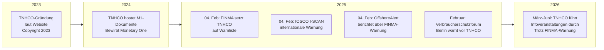

# Glaubwürdigkeitsanalyse: TNHCO — Warnungen, Register & Risiken

> **Stand:** 2026-07-01 | **Letzte FINMA-Aktualisierung:** 04.02.2025  
> **Verlinkte Dokumente:** [Hauptrecherche](WHITE_SPIRITUAL_BOY_RESEARCH.md) · [Ermittlungen](ERMITTLUNGEN_WARNUNGEN.md) · [Organigramm](ORGANIGRAMM_VERFLECHTUNGEN.md) · [Personen & Verflechtungen](PERSONEN_VERFLECHTUNGEN.md) · [Gesamtindex](INDEX.md)

---

## 🚨 ZENTRALE WARNUNG: FINMA führt TNHCO auf der Warnliste

Die **Schweizer Finanzmarktaufsicht FINMA** hat "Terra Nova Helvetica Genossenschaft" am **4. Februar 2025** auf ihre **offizielle Warnliste** gesetzt — die höchste Eskalationsstufe der Schweizer Finanzmarktaufsicht.

```mermaid
flowchart TB
        FINMA["🏛️ FINMA<br/>Swiss Financial Market<br/>Supervisory Authority"]
        TNHCO_WARN["⚠️ Terra Nova Helvetica<br/>Genossenschaft<br/>⚠️ AUF DER WARNLISTE"]
        REASON["❗ Verdacht auf<br/>unbewilligte Tätigkeiten<br/>im Finanzmarkt"]
    end

    subgraph "Internationale Verbreitung"
        IOSCO["🌐 IOSCO I-SCAN<br/>International Securities<br/>& Commodities Alerts<br/>Warning ID: 36211"]
        OFFSHORE["📰 OffshoreAlert<br/>Public Warning<br/>Switzerland"]
        VERBRAUCHER["🇩🇪 Verbraucherschutzforum<br/>Berlin"]
    end

    FINMA -->|"04.02.2025<br/>Warnliste"| TNHCO_WARN
    TNHCO_WARN -->|"Verdachtsgrund"| REASON
    FINMA -->|"Meldung an"| IOSCO
    IOSCO -->|"Kategorie:<br/>Unregistered/Unlicensed"| TNHCO_WARN
    OFFSHORE -->|"Berichtet über"| TNHCO_WARN
    VERBRAUCHER -->|"Warnt vor"| TNHCO_WARN

    style FINMA fill:#e17055,color:#fff,stroke:#cc0000,stroke-width:3px
    style TNHCO_WARN fill:#ff4444,color:#fff,stroke:#cc0000,stroke-width:2px
    style REASON fill:#ff6b6b,color:#fff
    style IOSCO fill:#6c5ce7,color:#fff
```

---

## 📋 1. FINMA-Warnung im Detail

| Merkmal | Detail |
|---------|--------|
| **Behörde** | FINMA (Eidgenössische Finanzmarktaufsicht) |
| **Datum** | 04. Februar 2025 |
| **Name** | Terra Nova Helvetica Genossenschaft |
| **Domizil** | **Menzingen** (nicht Neuheim!) |
| **Adresse** | Staldenstrasse 5, 6313 Menzingen |
| **Website** | tnhco.org |
| **Handelsregister** | Eingetragen (bedeutet NICHT Lizenz!) |
| **FINMA-Lizenz** | ❌ **KEINE** |
| **Verdacht** | Unbewilligte Tätigkeiten im Finanzmarkt |

📄 **Quelle:** [finma.ch — Warning List: Terra Nova Helvetica Genossenschaft](https://www.finma.ch/en/finma-public/warnungen/warning-list/terra-nova-helvetica-genossenschaft/)

### ⚠️ Was die FINMA-Warnliste bedeutet:

Die FINMA-Warnliste ist **keine unverbindliche Mitteilung**, sondern ein **eskaliertes Aufsichtsinstrument**:

1. **Verdacht auf Verstoß gegen Aufsichtsrecht** — TNHCO wird verdächtigt, Finanzdienstleistungen ohne die gesetzlich vorgeschriebene Bewilligung anzubieten
2. **Internationale Meldepflicht** — Die Warnung wurde an IOSCO I-SCAN gemeldet (weltweites Warnsystem der Wertpapieraufsichtsbehörden)
3. **Durchsetzungsmaßnahmen möglich** — Die FINMA kann Verwaltungszwangsmaßnahmen einleiten
4. **Strafrechtliche Relevanz** — Unbewilligte Finanzmarkttätigkeiten können strafbar sein

---

## 🌐 2. IOSCO I-SCAN — Internationale Warnung

Die **International Organization of Securities Commissions (IOSCO)** hat die FINMA-Warnung in ihr globales Warnsystem **I-SCAN** aufgenommen:

| Merkmal | Detail |
|---------|--------|
| **Warning ID** | 36211 |
| **NCA** | Switzerland — FINMA |
| **Datum** | 04.02.2025 |
| **Kategorie** | **Unregistered/Unlicensed entity offering financial products or services** |
| **Kommerzieller Name** | Terra Nova Helvetica Genossenschaft |

IOSCO ist der **Weltverband der Wertpapieraufsichtsbehörden** mit über 130 Mitgliedern. Ein I-SCAN-Eintrag bedeutet, dass **sämtliche Mitgliedsbehörden weltweit** vor TNHCO gewarnt werden.

📄 **Quelle:** [iosco.org — I-SCAN Warning #36211](https://www.iosco.org/i-scan/?id=36211)

---

## 🔑 3. Schlüsselpersonen (laut OffshoreAlert)

OffshoreAlert nennt in Verbindung mit TNHCO folgende **Namen** (Keywords):

| Name | Mögliche Rolle |
|------|---------------|
| **Georges Bolliger** | Möglicher Verwaltungsrat / Gründer |
| **Josef Marty** | Möglicher Verwaltungsrat / Gründer |
| **René Immoos** | Möglicher Verwaltungsrat / Gründer |
| **Valeria Manuel** | Mögliche zeichnungsberechtigte Person |

> ⚠️ Diese Namen stammen aus den OffshoreAlert-Keywords. Die tatsächlichen Rollen müssten durch einen **Handelsregisterauszug des Kantons Zug** verifiziert werden.

📄 **Quelle:** [offshorealert.com — Terra Nova Helvetica: Public Warning](https://www.offshorealert.com/terra-nova-helvetica-genossenschaft-public-warning-switzerland/)

---

## 📍 4. Diskrepanzen: Adressen & Register

### Widersprüchliche Standortangaben

| Quelle | Adresse | Ort |
|--------|---------|-----|
| TNHCO-Website | Industriestrasse 3 | **6345 Neuheim** |
| FINMA-Warnliste | Staldenstrasse 5 | **6313 Menzingen** |

⚠️ **Die FINMA und TNHCO selbst geben unterschiedliche Adressen an!**

- Neuheim und Menzingen sind Nachbargemeinden im Kanton Zug
- Die Diskrepanz könnte auf mehrere Standorte, Umzug oder inkonsistente Angaben hindeuten

### Handelsregister-Eintrag ≠ Lizenz

Die FINMA stellt ausdrücklich klar: TNHCO ist im Handelsregister eingetragen. **Dies bedeutet jedoch NICHT, dass das Unternehmen eine Bewilligung für Finanzdienstleistungen besitzt.** Ein Handelsregistereintrag ist ein rein formeller Akt und belegt keine Seriosität.

---

## 🔍 5. Glaubwürdigkeits-Checkliste

```mermaid
flowchart TD
        A["✅ Handelsregister-Eintrag<br/>(formell existent)"]
        B["✅ Physische Adresse<br/>in der Schweiz"]
    end

    subgraph "NEGATIV"
        C["❌ FINMA-Warnliste<br/>(höchste Eskalation)"]
        D["❌ IOSCO I-SCAN<br/>(internationale Warnung)"]
        E["❌ Keine FINMA-Lizenz<br/>(unbewilligte Tätigkeit)"]
        F["❌ Verdacht auf Verstoß<br/>gegen Aufsichtsrecht"]
        G["❌ Widersprüchliche<br/>Adressangaben"]
        H["❌ Fragwürdige<br/>Geschäftspartner (M1)"]
        I["❌ Verbindung zu<br/>WSB-Betrugsermittlungen"]
    end

    style C fill:#ff4444,color:#fff
    style D fill:#ff4444,color:#fff
    style E fill:#ff4444,color:#fff
    style F fill:#ff6b6b,color:#fff
```

---

## ⚖️ 6. Rechtliche Einordnung

### Schweizer Aufsichtsrecht

Nach Schweizer Recht benötigt **jedes Unternehmen, das gewerbsmäßig Finanzdienstleistungen erbringt**, eine Bewilligung der FINMA (Art. 3 ff. FINIG / Art. 3 ff. BankG). 

Die FINMA-Warnung bedeutet konkret:
- TNHCO bietet **möglicherweise Finanzprodukte oder -dienstleistungen an** (z.B. "Monetary One", "Treasury Bills M1", "CryptoXAu")
- TNHCO hat **keine Bewilligung** der FINMA dafür
- Die FINMA untersucht den **Verdacht auf unbewilligte Tätigkeit**
- Bei Bestätigung drohen **Verwaltungszwangsmaßnahmen** (Liquidation, Tätigkeitsverbot) und möglicherweise **strafrechtliche Konsequenzen**

### Internationale Dimension

Durch die IOSCO I-SCAN-Meldung sind **Wertpapieraufsichtsbehörden in über 130 Ländern** über die Warnung informiert. Dies kann zu:
- Parallelen Untersuchungen in anderen Ländern
- Warnungen durch andere nationale Behörden
- Erschwertem Zugang zu Bankdienstleistungen für TNHCO führen

---

## 📊 7. Chronologie der behördlichen Aktionen



---

## 🛡️ 8. Was bedeutet das für Interessenten?

### ❌ TNHCO ist KEIN reguliertes Finanzinstitut
- Keine Banklizenz
- Keine FINMA-Bewilligung als Finanzdienstleister
- Keine Einlagensicherung
- Keine Aufsicht durch eine anerkannte Behörde

### ⚠️ Risiken einer Beteiligung
1. **Kein Anlegerschutz** — keine Ombudsstelle, kein Einlagensicherungsfonds
2. **Rechtliche Unsicherheit** — die FINMA-Ermittlungen könnten zur Zwangsliquidation führen
3. **Reputationsrisiko** — Verbindung zu einem von mehreren Behörden gewarnten Netzwerk
4. **Finanzielles Totalverlustrisiko** — angebotene "Produkte" wie TB M1 oder CryptoXAu haben keinen realen Wertnachweis

---

## 📋 9. Quellenverzeichnis Glaubwürdigkeit

| # | Quelle | URL |
|---|--------|-----|
| 1 | FINMA Warnliste | [finma.ch — Terra Nova Helvetica Genossenschaft](https://www.finma.ch/en/finma-public/warnungen/warning-list/terra-nova-helvetica-genossenschaft/) |
| 2 | IOSCO I-SCAN | [iosco.org — Warning #36211](https://www.iosco.org/i-scan/?id=36211) |
| 3 | OffshoreAlert | [Terra Nova Helvetica: Public Warning](https://www.offshorealert.com/terra-nova-helvetica-genossenschaft-public-warning-switzerland/) |
| 4 | Verbraucherschutzforum Berlin | [FINMA-Info: TNHCO mit Handelsregistereintrag](https://verbraucherschutzforum.berlin/2025-02-04/finma-info-terra-nova-helvetica-genossenschaft-mit-handelsregistereintrag-348799/) |
| 5 | Scam Detector | [tnhco.org Reviews](https://www.scam-detector.com/validator/tnhco-org-review/) |
| 6 | TradersUnion | [Ist TNHCO sicher oder Betrug?](https://tradersunion.com/de/scam-or-safe/terra-nova-helvetica-genossenschaft-review/) |
| 7 | BrokerChooser | [Is TNHCO safe or a scam?](https://brokerchooser.com/safety/terra-nova-helvetica-genossenschaft-broker-safe-or-scam) |
| 8 | ritschel-keller.de | [Terra Nova Helvetica - Betrug beim Broker](https://ritschel-keller.de/terra-nova-helvetica-betrug-beim-broker/) |

---

## 🚨 Gesamtfazit

> **TNHCO ist ein von der FINMA offiziell gewarntes Unternehmen**, das im Verdacht steht, **ohne Bewilligung Finanzdienstleistungen anzubieten**. Die Warnung wurde international über IOSCO verbreitet. Das Unternehmen ist zwar im Handelsregister eingetragen, besitzt aber **keine Lizenz** als Finanzinstitut. In Verbindung mit den dokumentierten Ermittlungen zum M1/White-Spiritual-Boy-Netzwerk (siehe [ERMITTLUNGEN_WARNUNGEN.md](ERMITTLUNGEN_WARNUNGEN.md)) ergibt sich das Bild eines **hochriskanten Konstrukts ohne aufsichtsrechtliche Legitimation**.

---

> **Verlinkte Projektdokumente:** [📄 Hauptrecherche White Spiritual Boy](WHITE_SPIRITUAL_BOY_RESEARCH.md) · [🔍 Ermittlungen & Warnungen](ERMITTLUNGEN_WARNUNGEN.md) · [📊 Organigramm](ORGANIGRAMM_VERFLECHTUNGEN.md) · [📋 Gesamtindex](INDEX.md) · [📑 TNHCO Archiv](../markdown/) · [🌐 DE Übersetzungen](../markdown_de/)
