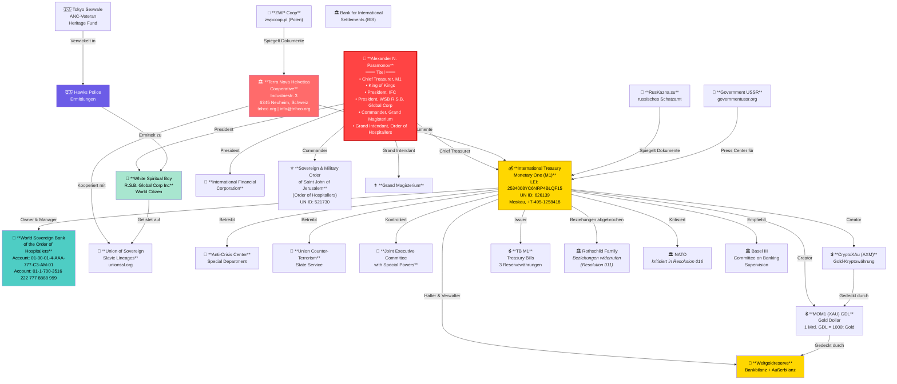
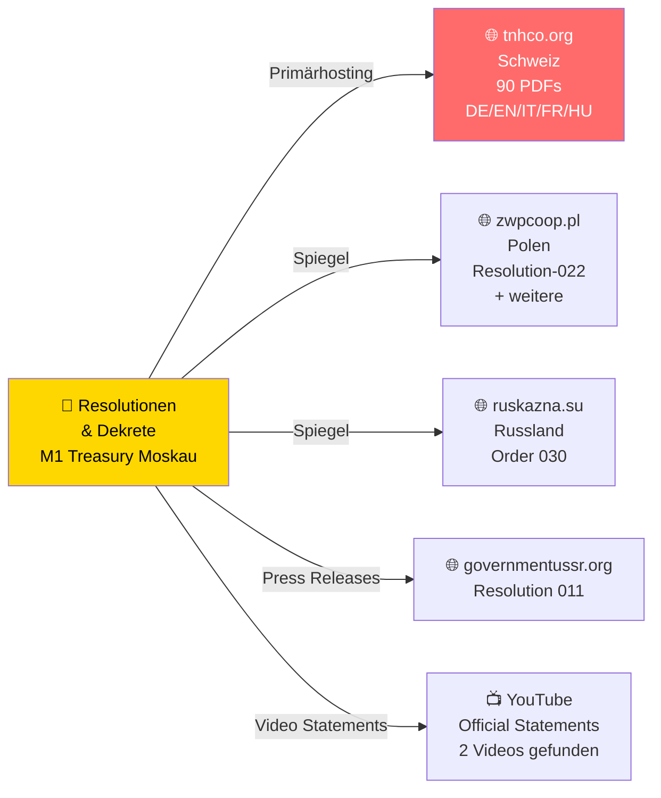
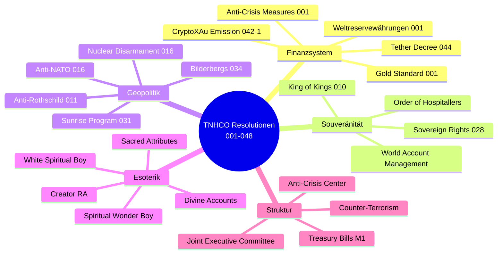
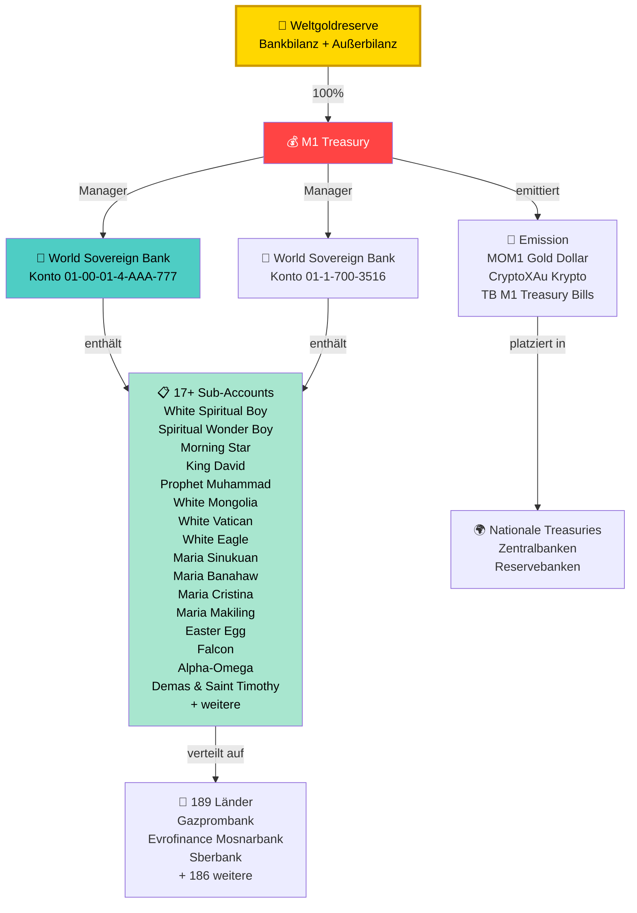
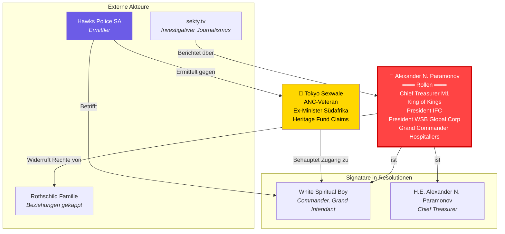
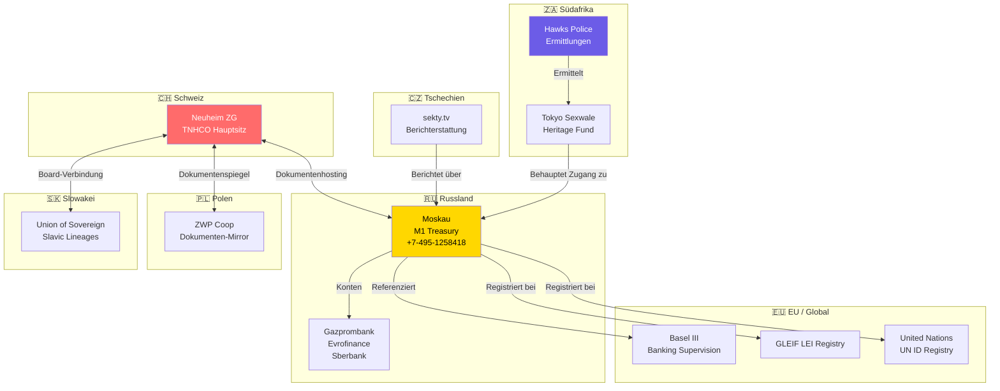

# TNHCO / White Spiritual Boy — Organigramm & Verflechtungen

> Sämtliche Verbindungen basierend auf Dokumentenanalyse und Internetrecherche
>
> 📎 **Verwandte Dokumente:** [Hauptrecherche](WHITE_SPIRITUAL_BOY_RESEARCH.md) · [Ermittlungen & Warnungen](ERMITTLUNGEN_WARNUNGEN.md) · [Gesamtindex](INDEX.md)

---

## 1. Gesamtnetzwerk (vollständige Verflechtung)

---

## 2. Dokumentenfluss & Mirrors

---

## 3. Resolutionen-Typologie & Themen

---

## 4. Geldflüsse (behauptet)

---

## 5. Akteursnetzwerk (Personen & Rollen)

---

## 6. Zeitstrahl der Schlüsselereignisse

```mermaid
timeline
    title Chronologie TNHCO / M1 / White Spiritual Boy
    section Vorgeschichte
        1961 : Goldener Sowjet-Rubel<br/>definiert (0.987g Gold)
        1944 : Bretton Woods<br/>Goldener US-Dollar
        2008 : White Spiritual Boy<br/>Account Audit $9.965 Mrd.
    section 2020
        April : Resolution 001<br/>Anti-Crisis Measures<br/>Paramonov tritt auf
        Juni : Resolution 002-003<br/>Weltfinanzsystem
    section 2021
        Feb-Okt : Resolutionen 004-007<br/>Strukturaufbau
        Dez : Resolution 008-009<br/>Weltaccount-Details
    section 2022
        Jan : Resolution 010<br/>King of Kings Proklamation
        Jan : Resolution 011<br/>Rothschild-Beziehungen beendet
        Jan-Nov : Resolutionen 012-022<br/>Operationelle Dekrete
    section 2023
        Jan-Dez : Resolutionen 023-043<br/>Expansion & Gold/Zyper
        Apr : Resolution 031 Sunrise
        Mai : Resolution 032 Pokon
        Jun : Resolution 033 Decree / 034 Bilderbergs
        Dez : 042-1 CryptoXAu / 043 DEC2023
    section 2024
        Jan : Resolution 044 Tether Decree
        Apr : Resolution 045
        Jul : Resolution 046
        Apr : sekty.tv Bericht über Paramonov
    section 2025
        Mai : Resolution 047
        Jun : Resolution 048
        SABC : Hawks-Ermittlungen zu Sexwale/Heritage Fund
    section 2026
        Mrz-Jun : TNHCO Infoveranstaltungen<br/>in der Schweiz
```

---

## 7. Geographische Verteilung

---

> **Hinweis:** Alle dargestellten Verbindungen basieren auf den in den TNHCO-Dokumenten gefundenen Angaben sowie öffentlich zugänglichen Internetquellen. Die Behauptungen der genannten Organisationen sind durch unabhängige Dritte nicht verifiziert.
