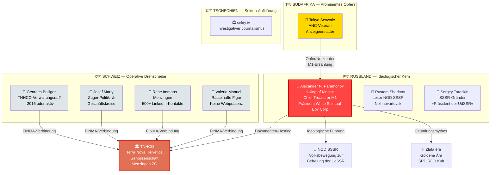
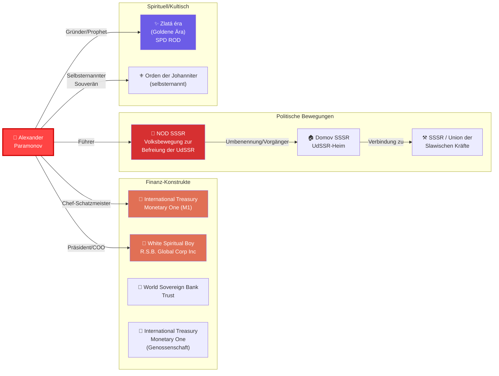
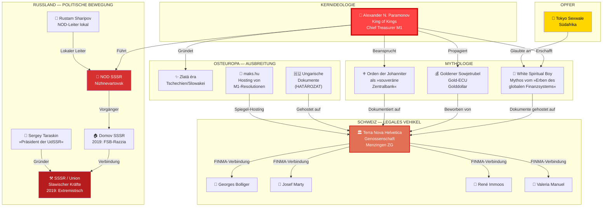
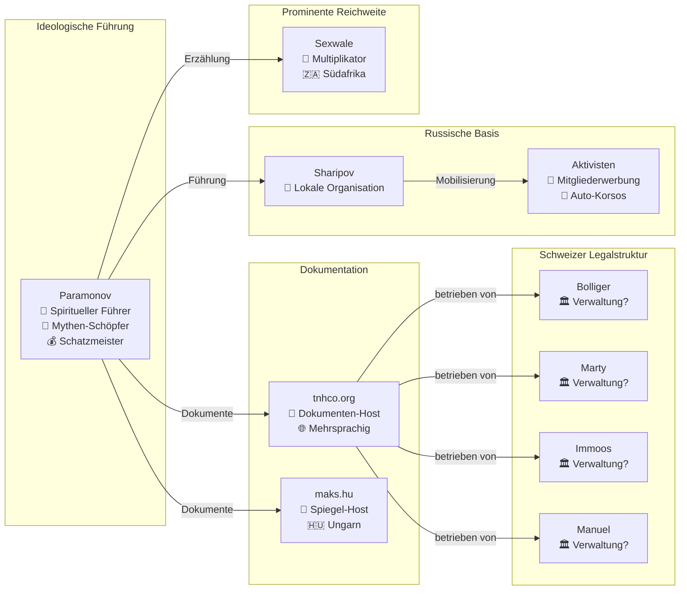

# Personen & Verflechtungen — Das TNHCO/M1/White-Spiritual-Boy Netzwerk

> **Stand:** 2026-07-01 | **Quellen:** FINMA, IOSCO, OffshoreAlert, sekty.tv, DuckDuckGo-Recherche, TNHCO-Archive  
> **Verlinkte Dokumente:** [Hauptrecherche](WHITE_SPIRITUAL_BOY_RESEARCH.md) · [Ermittlungen](ERMITTLUNGEN_WARNUNGEN.md) · [Glaubwürdigkeit](GLAUBWUERDIGKEIT_TNHCO.md) · [Organigramm](ORGANIGRAMM_VERFLECHTUNGEN.md) · [Gesamtindex](INDEX.md)

---

## 📊 Übersicht: Schlüsselpersonen

---

## 👑 1. Alexander Nikolaevich Paramonov — Der »King of Kings«

### Kernidentität

| Merkmal | Detail |
|---------|--------|
| **Vollständiger Name** | Alexander Nikolaevich Paramonov (Александр Николаевич Парамонов) |
| **Selbstverliehene Titel** | »His Majesty King of Kings«, »Kokke«, »Chief Treasurer«, »Grand Commander« |
| **Offizielle Rollen (laut M1-Dokumenten)** | Chief Treasurer of International Treasury Monetary One; President & COO of White Spiritual Boy R.S.B. Global Corp Inc; Secretary General |
| **UN-Registrierung (angeblich)** | UN No. 509519 |
| **Standort** | Nizhnevartovsk, Russland (Westsibirien) |
| **Ideologie** | Nekrokommunismus, UdSSR-Restauration, Anti-RF, Verschwörungstheorien |
| **Reichweite** | Russland, Tschechien/Slowakei (»Zlatá éra«), Ungarn, Schweiz |

### Organisationen & Strukturen

### Behauptungen (aus sekty.tv Interview mit Andrey Arkhipov)

Paramonovs Weltbild basiert auf folgenden Kernerzählungen:

1. **UdSSR existiert weiter** — Die Sowjetunion wurde nie rechtmäßig aufgelöst. Die Russische Föderation ist eine illegitime »Firma/LLC« und »Feind der UdSSR«
2. **M1 als neue Bretton-Woods-Institution** — Das International Treasury Monetary One sei von der UN-Generalversammlung akkreditiert und besitze alle globalen Goldreserven
3. **Drei Reservewährungen** — Goldener Sowjetrubel, Gold-ECU, goldgedeckter Dollar (vor Nixon)
4. **White Spiritual Boy als rechtmäßiger Erbe** — Alle Vermögenswerte des globalen Finanzsystems gehören dieser »Global Corporation« und wurden per Übertragungsurkunde an M1 übergeben
5. **IMF kontaktiert Paramonov** — Kristalina Georgieva (IWF-Chefin) habe ihn persönlich um Finanzhilfe zur Verhinderung eines 3. Weltkriegs gebeten
6. **Orden der Johanniter** — Paramonov behauptet, Souverän des Johanniterordens zu sein und die ECU als dessen nationale Währung zu kontrollieren
7. **Kampf gegen »drakonische Kräfte«** — In der »Zlatá éra«-Mythologie kämpft eine »weiße Planetenzivilisation« gegen einen »Drachen« (antisemitische Codes)

### Politische Aktivitäten in Russland

- **NOD SSSR**: Büro in Nizhnevartovsk, im selben Gebäude wie die Untersuchungsbehörde
- **Auto-Korso 2020**: Organisierte eine Pro-UdSSR-Autokolonne mit Sowjetfahnen — Teilnehmer wurden von der Polizei wegen »Extremismus« gestoppt
- **SSSR-Pässe**: Verkauf von sowjetischen Pässen für 3.000 Rubel, mit dem Versprechen, russische Gesetze zu umgehen
- **Lokaler Führer**: Rustam Sharipov leitet die Nizhnevartovsker Sektion
- **Verbindungen zu Extremismus-Fällen**: Das »Domov SSSR« (UdSSR-Heim) wurde 2019 vom FSB gestürmt, 20+ Mitglieder festgenommen

### Verbindung zu Sergey Taraskin

- **Sergey Taraskin** — Zahnarzt, selbsternannter »amtierender Präsident der UdSSR«
- Gründer des »SSSR« / »Union der Slawischen Kräfte Russlands« (2010)
- Organisation wurde im **Juli 2019 als extremistisch eingestuft**
- Paramonovs NOD SSSR scheint eine Abspaltung oder Rebranding dieser Bewegung zu sein

### Verbindung zu TNHCO

- **Dokumenten-Hosting**: Sämtliche M1-Resolutionen (001–048) und ungarische Dekrete werden auf tnhco.org gehostet
- **Inhaltliche Überschneidung**: TNHCO bewirbt das »Monetary One«-Programm
- **Geografische Trennung**: Paramonov operiert von Russland aus, TNHCO ist das Schweizer legale Vehikel
- **Keine direkte Namensnennung** auf der TNHCO-Website, aber indirekte Verbindung über die gehosteten Dokumente

---

## 🇨🇭 2. Die Schweizer TNHCO-Figuren (FINMA/OffshoreAlert)

### 2.1 Georges Bolliger

| Merkmal | Detail |
|---------|--------|
| **Name** | Georges Bolliger |
| **Verbindung zu TNHCO** | Als Keyword in OffshoreAlert zur FINMA-Warnung gelistet |
| **Mögliche Rolle** | Verwaltungsrat, Gründer oder Strohmann der Genossenschaft |
| **Todesanzeigen** | Es existieren Todesanzeigen für Georges Bolliger: 06.01.2016 (Sierre, Valais) und 03.04.2025 (deces.ch) |
| **Genealogie** | Geni.com-Profil existiert |

⚠️ **Wichtiger Hinweis**: Die Todesanzeige von 2016 aus Sierre/Valais könnte einen **anderen** Georges Bolliger betreffen. Der mit TNHCO verbundene Georges Bolliger könnte noch leben, oder der Name wird für einen bereits Verstorbenen weiterverwendet. Die deces.ch-Notiz vom 03.04.2025 könnte ebenfalls eine andere Person betreffen. **Ein Handelsregisterauszug des Kantons Zug wäre zur Klärung notwendig.**

**Recherche-Status**: 🟡 Ungeklärt — mehrere mögliche Georges Bolliger in der Schweiz

---

### 2.2 Josef Marty

| Merkmal | Detail |
|---------|--------|
| **Name** | Josef Marty |
| **Verbindung zu TNHCO** | Als Keyword in OffshoreAlert zur FINMA-Warnung gelistet |
| **Mögliche Rolle** | Verwaltungsrat, Gründer oder lokaler Vertreter |
| **Politische Aktivität** | Name erscheint in Zuger Kantonsdokumenten (Motion vom 05.02.2001) |
| **Lokale Präsenz** | Beteiligt an Gemeinde-Veranstaltungen im Kanton Zug (Crossiety-App) |
| **Erwähnung in Zuger Zeitung** | Leserbriefe zu lokalen Wahlen |

**Profil**: Josef Marty scheint eine lokal in Zug verwurzelte Person zu sein — möglicherweise mit politischem Hintergrund (Gemeinderat, Kantonsrat) und/oder geschäftlichen Aktivitäten. Die Verbindung zu einer parlamentarischen Motion (2001) deutet auf langjährige lokale Vernetzung hin.

**Recherche-Status**: 🟡 Teilweise identifiziert — lokale Zuger Persönlichkeit

---

### 2.3 René Immoos

| Merkmal | Detail |
|---------|--------|
| **Name** | René Immoos |
| **Verbindung zu TNHCO** | Als Keyword in OffshoreAlert zur FINMA-Warnung gelistet |
| **Standort** | **Menzingen** (laut LinkedIn-Profil) — identisch mit FINMA-Adresse! |
| **LinkedIn** | ch.linkedin.com/in/rené-immoos-70b96352 — 500+ Kontakte |
| **Branche** | Holzhaus-Bau (Planung & Konstruktion, Neuchâtel 7) |
| **Kulturelles** | IMDb-Eintrag: Mitwirkung an »Fierrabras« (2007, Opernhaus Zürich) |
| **Weiteres LinkedIn** | Zwei weitere Profile existieren (evtl. gleiche Person, mehrere Accounts) |

**Profil**: René Immoos scheint im Holzbaugewerbe tätig zu sein und hat kulturelle Interessen (Oper). Seine LinkedIn-Präsenz mit 500+ Kontakten und der Standort Menzingen — derselbe Ort, den die FINMA als TNHCO-Domizil nennt — macht ihn zur konkretesten identifizierbaren Person unter den TNHCO-Figuren.

**Recherche-Status**: 🟢 Identifiziert — Holzbau-Unternehmer aus Menzingen

---

### 2.4 Valeria Manuel

| Merkmal | Detail |
|---------|--------|
| **Name** | Valeria Manuel |
| **Verbindung zu TNHCO** | Als Keyword in OffshoreAlert zur FINMA-Warnung gelistet |
| **Identität** | **Keine Webpräsenz auffindbar** |
| **Mögliche Herkunft** | Der Name klingt italienisch/spanisch/rumänisch |
| **Spekulation** | Könnte aus dem ungarischen TNHCO-Netzwerk stammen (viele ungarische Dokumente auf tnhco.org) |

⚠️ **Auffällig**: Dass zu Valeria Manuel **keinerlei** Web-Ergebnisse zu finden sind, ist ungewöhnlich. Mögliche Erklärungen:
- Pseudonym / Alias-Name
- Person ohne digitale Präsenz (ältere Person)
- Name wurde in OffshoreAlert falsch geschrieben
- Person aus einem Land mit geringer Internet-Durchdringung

**Recherche-Status**: 🔴 Nicht identifizierbar

---

### 2.5 Weitere mögliche TNHCO-Personen

Die TNHCO-Website selbst nennt **keine** natürlichen Personen. Die Genossenschaftsstruktur erlaubt Anonymität der Mitglieder. Weitere Namen könnten aus folgenden Quellen stammen:
- **Handelsregister Kanton Zug** (kostenpflichtiger Auszug)
- **TNHCO-interne Dokumente** (Signaturen auf PDFs)
- **Ungarische Dokumente** (HATÁROZAT-Dateien auf tnhco.org — enthalten möglicherweise ungarische Namen)

---

## 🇿🇦 3. Tokyo Sexwale — Das prominente Gesicht

| Merkmal | Detail |
|---------|--------|
| **Vollständiger Name** | Mosima Gabriel »Tokyo« Sexwale |
| **Geboren** | 05.03.1953, Soweto, Südafrika |
| **Bekannt als** | ANC-Veteran, Anti-Apartheid-Aktivist, Robben-Island-Häftling (mit Mandela) |
| **Politische Karriere** | Premier von Gauteng (1994–1999), Minister für Human Settlements (2009–2013) |
| **Geschäftsmann** | Multimillionär, Mvelaphanda Group |
| **FIFA-Kandidatur** | Kandidierte 2017 für das FIFA-Präsidentenamt |
| **Rolle im M1-Komplex** | Anzeigeerstatter bei den Hawks (2021), behauptet Diebstahl aus »Heritage Fund« |

### Sexwales Verbindung zum Netzwerk

Sexwale ist **kein** Mitglied des engeren M1/TNHCO-Netzwerks, sondern ein **exponiertes Opfer bzw. Nutzer der Erzählung**:

- Er **glaubte** an die Existenz eines milliardenschweren »Heritage Fund« / »White Spiritual Boy Trust«
- Er behauptete, das Geld liege bei der **South African Reserve Bank (SARB)**
- Er nutzte seinen politischen Einfluss, um Ermittlungen zu erzwingen
- Zizi Kodwa (ANC-Sprecher): *»Sexwale might have fallen victim to a sophisticated network of scammers«*
- Die Hawks schlossen die Ermittlungen als **»unsubstantiated«** ab

Die Parallele zur Paramonov-Mythologie ist frappierend: Beide behaupten, es gäbe milliardenschwere »Heritage Funds« auf angeblichen Zentralbank-Konten, die für humanitäre Zwecke genutzt werden sollen.

---

## 🇨🇿 4. Die tschechische Aufklärung

### sekty.tv

Die tschechische Website **sekty.tv** (Sekten-TV) ist die **beste investigative Quelle** zum Paramonov-Netzwerk. Sie kategorisiert die Bewegung unter:

- **»Zlatá éra« (Goldene Ära) / SPD ROD** — Kult mit russisch-sowjetischer Mythologie
- **Schlüssel-Tags**: Antisemitismus, Manipulation, Nationalismus, Rassismus, Russland, Slawentum

### Warnsignale laut sekty.tv

Die sekty.tv-Analyse identifiziert folgende **extremistische Elemente**:

1. **Antisemitismus**: Die »drakonischen/dunklen Kräfte« sind ein klassischer antisemitischer Code
2. **Slawischer Rassismus**: »Helle« vs. »dunkle« Völker, slawische Überlegenheitserzählung
3. **Verschwörungsmythen**: IMF, UN, FED, BIZ als Marionetten der »dunklen Mächte«
4. **Nekrokommunismus**: Verklärung der nicht-existierenden UdSSR
5. **Personenkult**: Paramonov als »King of Kings« und Heilsbringer

---

## 🔗 5. Gesamtnetzwerk — Die Verflechtungen im Detail

---

## 📊 6. Chronologie der Personen & Organisationen

```mermaid
flowchart LR
    subgraph Y2010["2010"]
        A1["Sergey Taraskin gründet<br/>SSSR / Slawische Kräfte"]
    end
    subgraph Y2015["~2015-2019"]
        B1["Paramonov baut NOD SSSR<br/>in Nizhnevartovsk auf"]
        B2["Domov SSSR aktiv<br/>in versch. Städten"]
    end
    subgraph Y2019["Juli 2019"]
        C1["SSSR als extremistisch<br/>eingestuft"]
        C2["FSB stürmt Domov SSSR<br/>20+ Festnahmen"]
    end
    subgraph Y2020["2020"]
        D1["Mai: Paramonov organisiert<br/>Pro-UdSSR-Autokorso"]
        D2["01. Juni: Erste M1-Resolution<br/>Resolution-001 datiert"]
    end
    subgraph Y2021["2021"]
        E1["Februar: Resolution-004<br/>19-seitiges Manifest"]
        E2["April: Tokyo Sexwale<br/>erstattet Anzeige bei Hawks"]
    end
    subgraph Y2022["2022"]
        F1["Januar: Resolution-011<br/>Paramonov als King of Kings"]
        F2["M1-Dokumente erscheinen<br/>auf maks.hu (Ungarn)"]
    end
    subgraph Y2023["2023"]
        G1["TNHCO tritt als<br/>Website-Betreiber auf"]
        G2["15. Juni: Hawks stellen<br/>Fall ein — unsubstantiated"]
    end
    subgraph Y2024["2024"]
        H1["April: sekty.tv publiziert<br/>Paramonov-Recherche"]
        H2["TNHCO-Infoveranstaltungen<br/>in der Schweiz"]
    end
    subgraph Y2025["2025"]
        I1["04. Feb: FINMA setzt TNHCO<br/>auf die Warnliste"]
        I2["04. Feb: IOSCO I-SCAN<br/>Warnung #36211"]
        I3["Februar: OffshoreAlert<br/>nennt Bolliger/Marty/Immoos/Manuel"]
    end
    subgraph Y2026["2026"]
        J1["März-Juni: TNHCO macht weiter<br/>Infoveranstaltungen<br/>Trotz FINMA-Warnung"]
    end
    Y2010 --> Y2015 --> Y2019 --> Y2020 --> Y2021 --> Y2022 --> Y2023 --> Y2024 --> Y2025 --> Y2026
```

---

## ⚠️ 7. Rollenverteilung im Netzwerk

---

## 🔍 8. Offene Fragen & Recherchebedarf

| # | Frage | Priorität |
|---|-------|-----------|
| 1 | **Wer genau sind die Schweizer TNHCO-Verwaltungsräte?** Handelsregisterauszug Zug besorgen | 🔴 Hoch |
| 2 | Welche Rolle spielt **Valeria Manuel** konkret? Warum keine Webpräsenz? | 🔴 Hoch |
| 3 | Ist der TNHCO-Georges Bolliger identisch mit dem **2016 verstorbenen**? | 🟡 Mittel |
| 4 | Welche Verbindung besteht zu **maks.hu** und den ungarischen Akteuren? | 🟡 Mittel |
| 5 | Welche **Finanzflüsse** laufen zwischen Russland, Ungarn und der Schweiz? | 🟡 Mittel |
| 6 | Werden die M1-Dokumente tatsächlich bei der **UN** registriert (UN No. 509519)? | 🟢 Niedrig |
| 7 | Gibt es **weitere Spiegel-Domains** neben tnhco.org und maks.hu? | 🟢 Niedrig |

---

## 📋 9. Quellenverzeichnis Personen

| # | Quelle | URL | Relevanz |
|---|--------|-----|----------|
| 1 | sekty.tv — Paramonov-Interview | [Zlatý rubl SSSR se vrací](https://sekty.tv/2024/04/20/paramonov-zlaty-rubl-sssr-se-vraci-a-zachranuje-svetovou-ekonomiku/) | Paramonov direkte Aussagen |
| 2 | sekty.tv — Zlatá éra Analyse | [Co s tím má společného SSSR a extremismus?](https://sekty.tv/2024/04/20/sekta-zlata-era-co-s-tim-ma-spolecneho-sssr-a-extremismus/) | Extremismus-Einordnung |
| 3 | sekty.tv — Zlatá éra Mythos | [Mýtus sekty Zlatá éra](https://sekty.tv/2024/04/20/mytus-sekty-zlata-era/) | Kult-Mythologie Volltext |
| 4 | OffshoreAlert | [TNHCO Public Warning Switzerland](https://www.offshorealert.com/terra-nova-helvetica-genossenschaft-public-warning-switzerland/) | Nennung aller 4 Schweizer Personen |
| 5 | FINMA | [Terra Nova Helvetica Genossenschaft](https://www.finma.ch/en/finma-public/warnungen/warning-list/terra-nova-helvetica-genossenschaft/) | Offizielle Warnung |
| 6 | IOSCO I-SCAN | [Warning #36211](https://www.iosco.org/i-scan/?id=36211) | Internationale Warnung |
| 7 | governmentussr.org | [Resolution No. 011](https://governmentussr.org/press-center/news/suverennoe-mezhdunarodnoe-kaznacheystvo-m1/22-01-2022yr-sitm1-resolution-no-011/) | Paramonov-Titel dokumentiert |
| 8 | maks.hu | [Resolution-010.pdf](https://maks.hu/wp-content/uploads/2023/12/Resolution-010.pdf) | »King of Kings« Titel |
| 9 | LinkedIn | [René Immoos Profil](https://ch.linkedin.com/in/rené-immoos-70b96352) | Standort Menzingen, 500+ Kontakte |
| 10 | Geni.com | [Georges Bolliger](https://www.geni.com/people/Georges-Bolliger/6000000065603592873) | Genealogie |
| 11 | Le Nouvelliste | [Avis de décès Bolliger 2016](https://www.lenouvelliste.ch/avis-de-deces/georges-bolliger-486445) | Todesanzeige (evtl. andere Person) |
| 12 | deces.ch | [Georges BOLLIGER 2025](https://www.deces.ch/B/index.php?l=it&y=Georges&z=BOLLIGER) | Weitere Todesanzeige |
| 13 | kr-geschaefte.zug.ch | [Motion 2001](https://kr-geschaefte.zug.ch/dokumente/4251/pdoc_64_1.pdf) | Josef Marty in Zuger Politik |
| 14 | Zuger Zeitung | [Leserbrief Wahl](https://www.zugerzeitung.ch/meinung/leserbriefe-zz/leserbrief-zwei-meinungen-zum-zweiten-wahlgang-am-10-august-ld.2797047) | Josef Marty Erwähnung |

---

## 🚨 Fazit

Das TNHCO/M1/White-Spiritual-Boy-Netzwerk wird **zentral von Alexander Nikolaevich Paramonov** gesteuert — einem russischen Nekrokommunisten und Sektenführer, der sich selbst zum »King of Kings« und Schatzmeister eines angeblichen globalen Goldschatzes erklärt hat. 

Die **Schweizer TNHCO-Genossenschaft** dient als **legaler Mantel** für das Hosting der Dokumente und die Verbreitung der M1-Ideologie im deutschsprachigen Raum. Die von der FINMA und OffshoreAlert genannten Personen (Bolliger, Marty, Immoos, Manuel) bilden die **Schweizer Komponente** des Netzwerks — ihre genauen Rollen sind ohne Handelsregisterauszug nicht abschließend klärbar.

Die Verbindung zu **Tokyo Sexwale** zeigt, dass das Netzwerk auch **prominente Persönlichkeiten** als Multiplikatoren seiner Erzählung nutzt — teils wissentlich, teils als gutgläubige Opfer.

Die **FINMA-Warnung vom 04.02.2025** und die **IOSCO I-SCAN-Meldung** sind die bisher konkretesten behördlichen Maßnahmen direkt gegen die Schweizer Struktur des Netzwerks.

---

> **Verlinkte Projektdokumente:** [📄 Hauptrecherche White Spiritual Boy](WHITE_SPIRITUAL_BOY_RESEARCH.md) · [🔍 Ermittlungen & Warnungen](ERMITTLUNGEN_WARNUNGEN.md) · [🛡️ Glaubwürdigkeit TNHCO](GLAUBWUERDIGKEIT_TNHCO.md) · [📊 Organigramm](ORGANIGRAMM_VERFLECHTUNGEN.md) · [📋 Gesamtindex](INDEX.md) · [📑 TNHCO Archiv](../markdown/) · [🌐 DE Übersetzungen](../markdown_de/)
