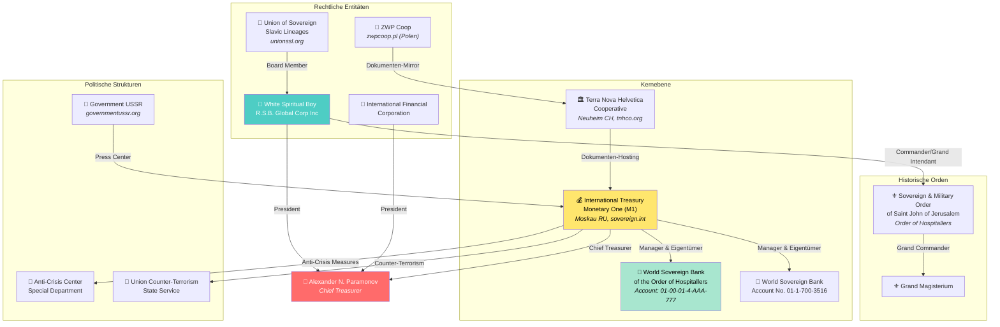
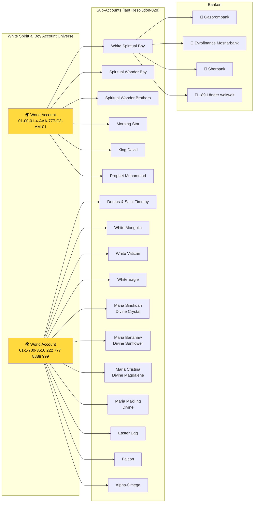
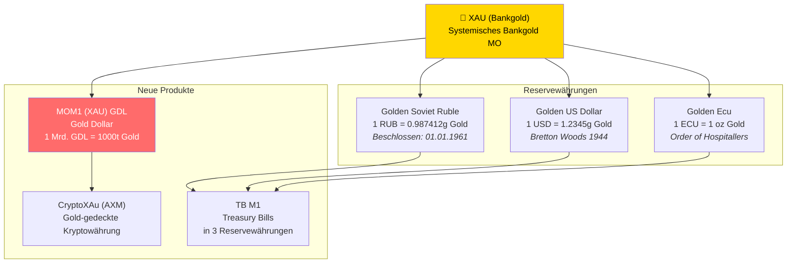
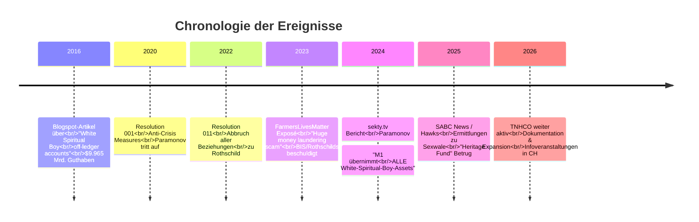
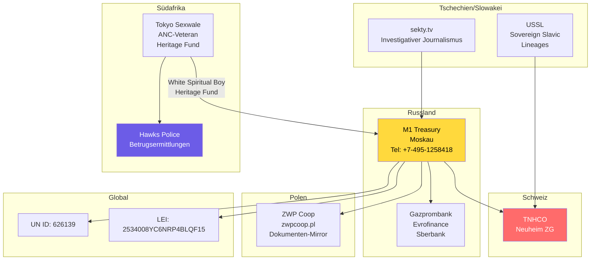
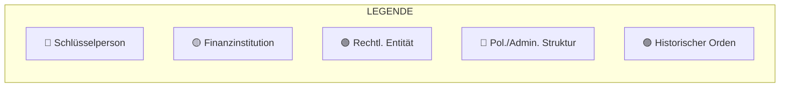

# White Spiritual Boy — Tiefenrecherche & Organisationsanalyse

> **Stand:** 2026-07-01 | **Quellen:** DuckDuckGo-Recherche, Webdokumente, TNHCO-Archive  
> **Hinweis:** Die folgenden Informationen stammen aus öffentlich zugänglichen Quellen. Viele Behauptungen der beteiligten Akteure sind nicht verifizierbar.
>
> 📎 **Verwandte Dokumente:** [Ermittlungen & Warnungen](ERMITTLUNGEN_WARNUNGEN.md) · [Organigramm](ORGANIGRAMM_VERFLECHTUNGEN.md) · [Glaubwürdigkeit TNHCO](GLAUBWUERDIGKEIT_TNHCO.md) · [Personen & Verflechtungen](PERSONEN_VERFLECHTUNGEN.md) · [Gesamtindex](INDEX.md)

---

## 📌 Executive Summary

**"White Spiritual Boy"** (auch: *White Spiritual Boy R.S.B. Global Corp Inc*) ist eine Schlüsselfigur in einem transnationalen Netzwerk aus selbstdeklarierten Souveränitätsorganisationen, alternativen Finanzinstitutionen und esoterischen Orden. Der Name fungiert gleichzeitig als:

1. **Rechtliche Entität** — eine registrierte Corporation  
2. **Kontobezeichnung** — ein angebliches Weltkonto mit Billionen-US-Dollar-Guthaben  
3. **Titel/Persona** — ein Signatar in offiziellen Dokumenten des International Treasury Monetary One  

Das Konstrukt vereint klassische Elemente von Souveränitätsbewegungen, anti-etablistischer Finanzrhetorik und esoterischer Symbolik.

---

## 🔑 Schlüsselperson: Alexander N. Paramonov

| Merkmal | Detail |
|---------|--------|
| **Name** | H.E. Alexander N. Paramonov |
| **Haupttitel** | Chief Treasurer, International Treasury Monetary One (M1) |
| **Weitere Titel** | President, International Financial Corporation; King of Kings (seit Resolution-010) |
| **Nationalität** | Russisch (Dokumente tragen russische Stempel + Moskauer Telefonnummern) |
| **Erster Auftritt** | Resolution 001, 7. April 2020 |

**Paramonov behauptet:**
- Der rechtmäßige Verwalter aller Weltgoldreserven zu sein (sowohl Bankbilanz- als auch außerbilanzliches Gold)
- Die Kontrolle über das "Weltkonto" bei der "World Sovereign Bank of the Order of Hospitallers" zu haben
- Im Besitz von 1000 Tonnen Gold für die Emission der Kryptowährung CryptoXAu zu sein
- Titelinhaber "King of Kings" (höchster Souveränitätsstatus)

---

## 🏛️ Organisationsnetzwerk

### Kernorganisationen

---

### Die "White Spiritual Boy"-Kontenstruktur

---

## 💰 Monetäre Ansprüche & Finanzprodukte

### Währungen & Werte

---

## ⚖️ Kontroversen & Ermittlungen

---

## 🌐 Internationale Verbindungen

---

## 🔗 Vollständige Verflechtungsmatrix

---

## 📋 Quellenverzeichnis

| # | Quelle | URL | Relevanz |
|---|--------|-----|----------|
| 1 | TNHCO Archiv | tnhco.org/documents_de/ | 90 Original-PDFs |
| 2 | Union of Sovereign Slavic Lineages | unionssl.org/board/ | Board-Listing WSB |
| 3 | Government USSR | governmentussr.org | Resolution 011 (Rothschild) |
| 4 | ZWP Coop (Polen) | zwpcoop.pl | Dokumenten-Mirror |
| 5 | Farmers Lives Matter SA | farmerslivesmattersa.com | Geldwäsche-Exposé |
| 6 | Alcuin Bramerton Blog | alcuinbramerton.blogspot.com | Off-Ledger Accounts (2016) |
| 7 | Scribd | scribd.com/document/443200111 | Account Exposé |
| 8 | Scribd | scribd.com/document/154071733 | Bank Accounts Summary |
| 9 | SABC News | sabcnews.com | Hawks-Ermittlungen Sexwale |
| 10 | sekty.tv | sekty.tv/2024/04/20/paramonov... | Investigativer Bericht |
| 11 | YouTube | youtube.com/watch?v=UZgLvF2bkm4 | Official Statement M1 |
| 12 | YouTube | youtube.com/watch?v=1X9sMy-M4es | RA Monetary One Sunrise |
| 13 | Strikingly CDN | uploads.strikinglycdn.com | Transkript Global Crisis |

---

## 🚨 Kritische Bewertung

### Typische Indikatoren für problematische Souveränitäts-/Finanzkonstrukte:

1. **Erfundene Titel & Ämter** — "King of Kings", "Commander of the Grand Magisterium", Fantasie-Orden
2. **Unbelegte Milliarden-/Billionenforderungen** — Keine unabhängige Prüfung der angeblichen Kontoguthaben
3. **Anti-Establishment-Rhetorik** — Rothschild, Weltbank, Federal Reserve als Feindbilder
4. **Esoterische/religiöse Symbolik** — "Creator RA", spirituelle Kontonamen, göttliche Mandate
5. **Pseudorechtliche Dokumente** — "Resolutions", "Decrees", "Orders" ohne staatliche Rechtskraft
6. **LEI/UN-ID als Legitimitätsanker** — Echte Registrierungsnummern werden als staatliche Anerkennung dargestellt
7. **Internationale Spiegel-Domains** — Selbe Dokumente auf tnhco.org, zwpcoop.pl, russischen Servern
8. **Laufende Ermittlungen** — Südafrikanische Hawks untersuchen Betrug im Zusammenhang mit dem "Heritage Fund"

---

> **Disclaimer:** Diese Analyse basiert auf öffentlich zugänglichen Quellen. Die Behauptungen der genannten Organisationen und Personen sind durch unabhängige Stellen nicht verifiziert. Die Dokumente spiegeln die Selbstdarstellung der Akteure wider.
