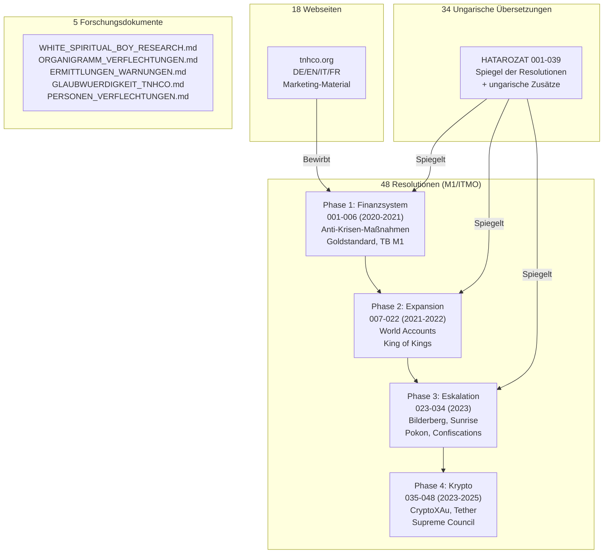

# ANALYSE-INDEX — Systematische Durcharbeitung aller TNHCO/M1-Dokumente

> **Stand:** 2026-07-01 | **Quellen:** 90 OCR-Dokumente, 18 Webseiten  
> **Übergeordnet:** [Gesamtindex](INDEX.md) · [Personen](PERSONEN_VERFLECHTUNGEN.md) · [Ermittlungen](ERMITTLUNGEN_WARNUNGEN.md)

---

## 📊 Dokumenten-Taxonomie

---

## 📑 Einzeldokument-Analysen

### Phase 1: Anti-Krisen-Maßnahmen (2020-2021)

| # | Dokument | Analyse |
|---|----------|---------|
| 001 | Resolution-001 (07.04.2020) | [→ Analyse](001_Anti-Crisis.md) |
| 002 | Resolution-002_en (02.06.2020) | [→ Analyse](002_World_Finance.md) |
| 003 | Resolution-003_en (01.10.2020) | [→ Analyse](003_Basel_III.md) |
| 004 | Resolution-004 (23.02.2021) | [→ Analyse](004_Historical_Assets.md) |
| 005 | Resolution-005 (16.07.2021) | [→ Analyse](005_Gold_Bullion.md) |
| 006 | Resolution-006 (13.09.2021) | [→ Analyse](006_TB_M1.md) |

### Phase 2: Expansion & World Accounts (2021-2022)

| # | Dokument | Analyse |
|---|----------|---------|
| 007 | Resolution-007 (01.10.2021) | [→ Analyse](007_Structure.md) |
| 008 | Resolution-008 (21.12.2021) | [→ Analyse](008_Accounts.md) |
| 009 | Resolution-009 (24.12.2021) | [→ Analyse](009_Global_Crisis.md) |
| 010 | Resolution-010 (13.01.2022) | [→ Analyse](010_King_of_Kings.md) |
| 011 | Resolution-011 (22.01.2022) | [→ Analyse](011_Rothschild.md) |
| 012-017 | Resolutionen 012-017 (02-05.2022) | [→ Analyse](012-017_Operational.md) |
| 018 | Resolution-018 (22.07.2022) | [→ Analyse](018_Fed_Default.md) |
| 019-022 | Resolutionen 019-022 (09-11.2022) | [→ Analyse](019-022_Expansion.md) |

### Phase 3: Eskalation (2023)

| # | Dokument | Analyse |
|---|----------|---------|
| 023-030 | Resolutionen 023-030 (12.2022-03.2023) | [→ Analyse](023-030_Regulations.md) |
| 031 | Resolution-031_Sunrise (18.04.2023) | [→ Analyse](031_Sunrise.md) |
| 032 | Resolution-032_Pokon (19.05.2023) | [→ Analyse](032_Pokon.md) |
| 033 | Resolution-033_Decree (02.06.2023) | [→ Analyse](033_Divine_Law.md) |
| 034 | Resolution-034_Bilderbergs (02.06.2023) | [→ Analyse](034_Bilderbergs.md) |

### Phase 4: Krypto & Supreme Council (2023-2025)

| # | Dokument | Analyse |
|---|----------|---------|
| 035-041 | Resolutionen 035-041 (06-10.2023) | [→ Analyse](035-041_Proclamations.md) |
| 042 | Resolution-042 (18.10.2023) | [→ Analyse](042_Crypto_Ban.md) |
| 042-1 | Decree-CryptoXAu (13.12.2023) | [→ Analyse](042-1_CryptoXAu.md) |
| 043 | DEC2023 (25.12.2023) | [→ Analyse](043_DEC2023.md) |
| 044 | Decree-Tether (17.01.2024) | [→ Analyse](044_Tether.md) |
| 045-048 | Resolutionen 045-048 (04.2024-06.2025) | [→ Analyse](045-048_Final.md) |

---

## 🔬 Querschnitts-Analysen

| Dokument | Beschreibung |
|----------|-------------|
| [UNGEREIMTHEITEN.md](UNGEREIMTHEITEN.md) | 🚨 Widersprüche, fehlende Beweise, logische Brüche |
| [THEMEN_VERMISCHUNG.md](THEMEN_VERMISCHUNG.md) | 🔀 Analyse der Themenvermischung (Finanzen/Religion/Verschwörung) |
| [GELDSYSTEM_PARADOX.md](GELDSYSTEM_PARADOX.md) | 💰 Warum ein eigenes Geldsystem, wenn man Geldsysteme für betrügerisch hält? |
| [VERFLECHTUNGSGRAPH.md](VERFLECHTUNGSGRAPH.md) | 📊 Gesamtgraph aller Dokumenten-Referenzen |

---

## 📊 Schnell-Übersicht: Die 10 wichtigsten Resolutionen

| # | Titel | Kernaussage | Beweise? |
|---|-------|-------------|----------|
| 001 | Anti-Crisis Measures | M1 kontrolliert alles Weltgold | ❌ Keine |
| 004 | Historical Assets | Alle historischen Assets annulliert | ❌ Keine |
| 010 | King of Kings | Paramonov zum König gekrönt | ❌ Keine |
| 011 | Rothschild | Alle Beziehungen zu Rothschild gekappt | ❌ Keine |
| 018 | Fed Default | USA ist "Corporation", Fed entmachtet | ❌ Keine |
| 024 | Order No 24 | Alle Länder illegal, USSR nur legitim | ❌ Keine |
| 031 | Sunrise | Goldstandard-Beitrittsverfahren | ❌ Keine |
| 034 | Bilderbergs | 120+ Personen namentlich angeklagt | ❌ Keine |
| 042 | Crypto Ban | Alle Kryptos außer M1-eigenen verboten | ❌ Keine |
| 042-1 | CryptoXAu | 1 Mrd. Gold Dollar = 1000t Gold | ❌ Keine |
