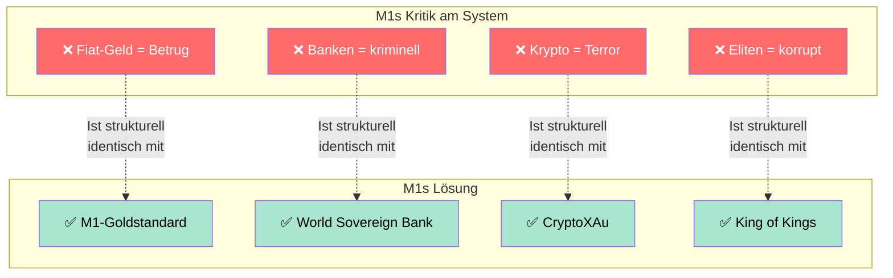

# GELDSYSTEM-PARADOX — Warum ein eigenes Geldsystem gegen Betrug?

> **Stand:** 2026-07-01  
> **Verlinkt:** [Analyse-Index](ANALYSE_INDEX.md) · [Ungereimtheiten](UNGEREIMTHEITEN.md) · [Themen-Vermischung](THEMEN_VERMISCHUNG.md)

---

## 💰 Das zentrale Paradox

Die M1-Dokumente behaupten durchgängig:

> *"Das bestehende Weltfinanzsystem ist betrügerisch, kriminell und muss zerstört werden."*

Gleichzeitig etablieren sie:

> *"Unser eigenes Weltfinanzsystem (M1, MOM1, CryptoXAu, TB M1) ist die Lösung."*

**Das Paradox:** Wenn ALLE Geldsysteme inhärent betrügerisch sind — warum sollte dann ausgerechnet DAS HIER nicht betrügerisch sein?

---

## 🔍 Die Widersprüche im Detail

### Widerspruch A: "Fiat-Geld ist Betrug" → "Unsere Fiat-Währung ist die Lösung"

| Was M1 kritisiert | Was M1 selbst tut |
|-------------------|-------------------|
| Fiat-Geld ohne intrinsischen Wert | M1 kreiert neue Währungseinheiten per Dekret |
| Zentralbanken drucken Geld aus dem Nichts | M1 "emittiert" TB M1 und XAU ohne nachgewiesene Deckung |
| Dollar/ Euro sind "kriminell" | M1s eigener "Gold Dollar" und "ECU" existieren nur auf Papier |

**Die ECU (European Currency Unit)** — von M1 zur Reservewährung erklärt — war selbst eine **reine Korbwährung ohne physische Form** (1979-1998). Also genau das, was M1 als "Fiat-Geld" verurteilt. Dass M1 sie als "goldgedeckt" bezeichnet, ist eine reine Behauptung.

---

### Widerspruch B: "Banken sind kriminell" → "Unsere Bank ist die Lösung"

| Was M1 kritisiert | Was M1 selbst tut |
|-------------------|-------------------|
| Zentralbanken kontrollieren das System | M1s "World Sovereign Bank" soll ALLE Banken kontrollieren |
| Fed/IMF/World Bank sind "Werkzeuge der Elite" | M1 beansprucht die GLEICHEN Kontonummern bei der World Bank |
| Private Banken sind "Illuminati-gründet" | M1s Bank wird nie geprüft, nie auditiert, nie registriert |

**Frage:** Wenn die World Bank ein "Werkzeug neo-kolonialistischer Interessen" ist (Res. 018) — warum beansprucht M1 dann Konten BEI der World Bank? Entweder die World Bank ist kriminell (dann will man keine Konten dort), oder sie ist legitim (dann ist M1s Kritik hinfällig).

---

### Widerspruch C: "Gold gehört der Menschheit" → "Gold gehört UNS"

| Resolution | Position zu Gold |
|------------|-----------------|
| 001, 006, 009 | Goldstandard soll ALLEN Ländern nutzen, "für die Menschheit" |
| 004, 011, 024, 042 | M1 ist "Halter und Verwalter des GESAMTEN Weltgoldes" |
| 042 | Johanniter-Orden besitzt ALLES LAND der Welt |

**Frage:** Soll der Goldstandard die Menschheit befreien — oder M1 zur alleinigen Kontrollinstanz über alles Gold machen? Die Dokumente behaupten BEIDES gleichzeitig.

---

### Widerspruch D: "Krypto ist kriminell" → "Unsere Krypto ist die Lösung"

| Resolution | Position zu Krypto |
|------------|-------------------|
| 006, 028, 042 | **ALLE** Kryptowährungen sind verboten, "Finanzterrorismus" |
| 042-1 | CryptoXAu (AXM) wird als M1-eigene Kryptowährung geschaffen |

**Begründung in 042-1:** CryptoXAu sei "durch 1.000 Tonnen Gold gedeckt".

**Frage:** Wo sind diese 1.000 Tonnen Gold? Welches unabhängige Audit bestätigt sie? Ohne Audit ist CryptoXAu genau das, was M1 allen anderen Kryptos vorwirft: **eine Behauptung ohne Deckung.**

---

## 🎭 Die Struktur des Paradoxons

**Die entscheidende Frage:** Was unterscheidet M1s System von dem System, das M1 kritisiert?

| Merkmal | Bestehendes System | M1-System |
|---------|-------------------|-----------|
| Golddeckung? | ❌ Fiat | ✅ Behauptet (kein Audit) |
| Bankenaufsicht? | ✅ Reguliert (BASEL, FINMA, EZB) | ❌ Keine |
| Transparenz? | ✅ Bilanzen, Geschäftsberichte | ❌ Keine (nur Dekrete) |
| Rechtsgrundlage? | ✅ Nationale + internationale Gesetze | ❌ "Göttliches Gesetz" |
| Demokratische Kontrolle? | ⚠️ Teilweise | ❌ Monarchie (King of Kings) |
| Einlagensicherung? | ✅ Bis 100.000€ (EU) / 250.000$ (US) | ❌ Keine |
| Beschwerdeinstanz? | ✅ Ombudsstellen, Gerichte | ❌ Keine |

---

## 🧠 Psychologische Funktion des Paradoxons

Warum funktioniert dieses Paradox bei Anhängern?

1. **"Das System ist kaputt"** → schafft Angst und Misstrauen
2. **"Nur wir können es reparieren"** → bietet die einzige Rettung
3. **"Unsere Lösung kann nicht scheitern"** → weil sie "göttlich" legitimiert ist
4. **Kritiker sind Teil der Verschwörung** → Immunisierung

Dieser Viertakt ist das **Standard-Repertoire von Finanzkulten** weltweit.

---

## 📋 Fazit

> Die M1-Dokumente kritisieren das bestehende Finanzsystem mit Argumenten, die **auf M1s eigenes System noch stärker zutreffen**: keine Aufsicht, keine Transparenz, keine Beweise für Golddeckung, keine demokratische Legitimation.

Der Unterschied zwischen "Betrug" und "Lösung" ist in den Dokumenten **rein behauptet, nie belegt.** Das ist das zentrale Paradox — und das zentrale Warnsignal.

---

> **Verlinkt:** [Analyse-Index](ANALYSE_INDEX.md) · [Ungereimtheiten](UNGEREIMTHEITEN.md) · [Themen-Vermischung](THEMEN_VERMISCHUNG.md)
