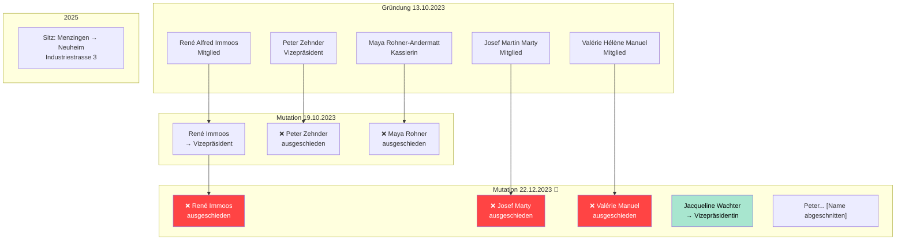
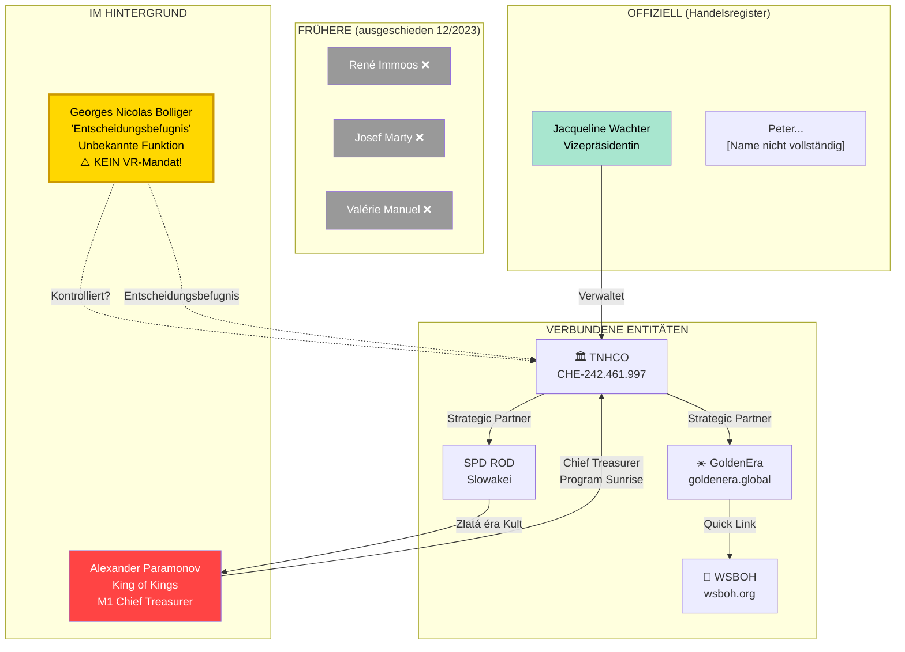

# Georges Nicolas Bolliger — Vollständige Recherche

> **Stand:** 01.07.2026 | **Quellen:** Zefix, SHAB, North Data, business-monitor.ch, OffshoreAlert, FINMA  
> **Verlinkt:** [Personen](../PERSONEN_VERFLECHTUNGEN.md) · [Glaubwürdigkeit](../GLAUBWUERDIGKEIT_TNHCO.md) · [GoldenEra](GOLDENERA_GLOBAL.md)

---

## 📋 Steckbrief

| Merkmal | Detail |
|---------|--------|
| **Vollständiger Name** | Georges Nicolas Bolliger |
| **Wohnort** | Menzingen, Kanton Zug, Schweiz |
| **Rolle bei TNHCO** | "Entscheidungsbefugnis" (decision authority) — **Unbekannte Funktion!** |
| **Im Handelsregister?** | ❌ **NICHT als Verwaltungsrat eingetragen** |
| **Vorherige Firma** | simpleapps.ch GmbH (IT-Programmierung) |
| **Rolle dort** | Prokurist (2013–2017), davor VR-Präsident |
| **Geschäftspartner** | Serdar Kilic, Bahadir Durak |
| **Branchen-Hintergrund** | IT/Programmierung — **KEIN** Finanzhintergrund! |

---

## 🔍 Wer ist Georges Nicolas Bolliger?

### Der unsichtbare Strippenzieher

Georges Nicolas Bolliger ist die **rätselhafteste Figur** im TNHCO-Komplex. Obwohl er von OffshoreAlert und business-monitor.ch als Schlüsselperson mit "Entscheidungsbefugnis" gelistet wird, **taucht sein Name in keiner Verwaltungsratsliste des Handelsregisters auf.** Seine Funktion bei TNHCO ist offiziell "unbekannt".

### Die Fakten

1. **Nicht im Handelsregister als Organ eingetragen** — weder Präsident, noch Vizepräsident, noch Mitglied der Verwaltung
2. **"Entscheidungsbefugnis"** aber keine definierte Rolle — das ist extrem ungewöhnlich für eine Schweizer Genossenschaft
3. **Name erscheint NUR auf business-monitor.ch und OffshoreAlert** — nicht auf tnhco.org, nicht in Resolutionen
4. **Wohnsitz Menzingen** — dieselbe Gemeinde wie die ursprüngliche TNHCO-Adresse (Staldenstrasse 5)

---

## 🏢 TNHCO Board-Historie (aus SHAB/Zefix)

### Gründung (13.10.2023)

TNHCO wurde am 13.10.2023 in **Menzingen, Staldenstrasse 5** gegründet.

**Zweck laut Statuten:**
> "Die Terra Nova Genossenschaft bezweckt die Förderung der vierten Altersvorsorgesäule, der sozialen Gemeinnützigkeit und anderer Projekte zur Stärkung des Generationenzusammenhalts im Interesse der Allgemeinheit. **Die Genossenschaft verfolgt keinerlei Erwerbszweck.**"

⚠️ **Diese Zweckbeschreibung erwähnt mit KEINEM Wort Finanzdienstleistungen, Treasury, Monetary One, Gold oder Krypto.**

### Board-Entwicklung

### 🚨 Der Massen-Rücktritt vom 22.12.2023

**Nur 2 Monate nach Gründung** traten **ALLE DREI** von OffshoreAlert genannten Personen gleichzeitig zurück:

| Person | Rolle | Status |
|--------|-------|--------|
| **René Alfred Immoos** | Vizepräsident | ❌ Ausgeschieden 22.12.2023 |
| **Josef Martin Marty** | Mitglied | ❌ Ausgeschieden 22.12.2023 |
| **Valérie Hélène Manuel** | Mitglied | ❌ Ausgeschieden 22.12.2023 |

Ersetzt wurden sie durch:
- **Jacqueline Josefine Heidi Wachter** → Vizepräsidentin
- **Peter...** [Name abgeschnitten]

**Dieser kollektive Rücktritt nach nur 2 Monaten ist höchst ungewöhnlich** und deutet entweder auf:
1. Interne Konflikte
2. Die drei waren von Anfang an nur Strohmänner für die Gründung
3. Sie entdeckten, worauf sie sich eingelassen hatten, und stiegen aus

---

## 👤 Die ursprünglichen Board-Mitglieder

### René Alfred Immoos

| Merkmal | Detail |
|---------|--------|
| **Voller Name** | René Alfred Immoos |
| **Bürgerort** | Schwyz (!) |
| **Wohnort (2023)** | Menzingen |
| **Funktion** | Mitglied → Vizepräsident (19.10.2023) → Ausgeschieden (22.12.2023) |
| **Beruflich** | Holzbau-Unternehmer; LinkedIn 500+ Kontakte; Opernhaus Zürich |

### Josef Martin Marty

| Merkmal | Detail |
|---------|--------|
| **Voller Name** | Josef Martin Marty |
| **Bürgerort** | Oberiberg (Kanton Schwyz) |
| **Wohnort** | Unteriberg |
| **Funktion** | Mitglied → Ausgeschieden (22.12.2023) |
| **Hintergrund** | Lokale Zuger Politik (Motion 2001) |

### Valérie Hélène Manuel

| Merkmal | Detail |
|---------|--------|
| **Voller Name** | Valérie Hélène Manuel |
| **Bürgerort** | Rolle (Kanton Waadt) |
| **Wohnort** | Menzingen |
| **Funktion** | Mitglied → Ausgeschieden (22.12.2023) |
| **Korrektur** | Ursprünglich als "Valeria" registriert, am 18.10.2023 auf "Valérie" korrigiert |

---

## 🏢 Bolligers vorherige Firma: simpleapps.ch GmbH

| Merkmal | Detail |
|---------|--------|
| **Firma** | simpleapps.ch GmbH |
| **UID** | CHE-303.785.801 |
| **Gründung** | 25.04.2013 als "Global Service Provider Consulting GmbH" |
| **Sitz** | Neuheim (gleiche Gemeinde wie TNHCO heute!) |
| **Branche** | **Programmierungstätigkeiten** (IT-Software) |
| **Gründer** | Serdar Kilic (Gesellschafter + GF), Bahadir Durak (Prokurist), Georges Nicolas Bolliger (Prokurist) |
| **Bolligers Rolle** | Prokurist (2013), dann VR-Präsident (2014-2016), ausgeschieden 23.06.2017 |
| **Kapital** | 20.000 CHF |

**⚠️ Bolliger hat KEINEN Finanz-Hintergrund.** Seine Karriere war IT-Programmierung und Consulting — nicht Banking, Treasury oder Vermögensverwaltung.

---

## 🔗 Die Slowakei-Verbindung

### Was wir wissen

- **SPD ROD** (Slovenské Podielové Druzstvo ROD) wird auf goldenenera.global als "Strategic Partner" gelistet
- SPD ROD = Zlatá éra Kult in der Slowakei, direkt mit Alexander Paramonov verbunden
- Auf TNHCO-Infoveranstaltungen (laut Website) wurde offenbar erwähnt, dass bereits eine Genossenschaft in der Slowakei existiert

### Bolligers mutmaßliche Aussage

Laut Nutzer-Hinweis äußerte Bolliger sinngemäß:
> "Es gibt bereits eine Genossenschaft in der Slowakei, die funktioniert."

Dies bezieht sich mit hoher Wahrscheinlichkeit auf **SPD ROD**, die slowakische Genossenschaft, die:
- Im Paramonov-Netzwerk als "Zlatá éra" (Goldene Ära) Kult operiert
- Auf goldenenera.global als strategischer Partner gelistet ist
- Die slowakische Rechtsform "Podielové Druzstvo" (Anteilsgenossenschaft) nutzt
- Als "Beweis" dafür dienen soll, dass das Modell funktioniert

**⚠️ Kritische Einordnung:**
1. SPD ROD ist **kein** unabhängiges Erfolgsbeispiel — es ist Teil desselben Kult-Netzwerks
2. Die Berufung auf eine existierende slowakische Genossenschaft sagt nichts über deren Legalität oder Erfolg aus
3. Dies ist eine klassische Verkaufstaktik: "Schau, es funktioniert bereits in Land X"

---

## 📊 Das Machtgefüge — Wer kontrolliert TNHCO wirklich?

---

## 🚨 Ungereimtheiten & Red Flags

| # | Fund | Bedeutung |
|---|------|-----------|
| 1 | **Bolliger hat keinen Finanz-Hintergrund** | IT-Programmierer kontrolliert angebliches "Weltfinanzsystem" |
| 2 | **"Entscheidungsbefugnis" ohne VR-Mandat** | Wer kontrolliert wen? Intransparente Machtstruktur |
| 3 | **Drei OffshoreAlert-Personen traten nach 2 Monaten kollektiv zurück** | Immoos, Marty, Manuel — alle gleichzeitig raus |
| 4 | **TNHCO-Zweck erwähnt KEINE Finanzdienstleistungen** | "Altersvorsorge" und "Gemeinnützigkeit" — nicht Treasury, nicht Gold |
| 5 | **"Keinerlei Erwerbszweck"** | Aber bewirbt aktiv Finanzprodukte und ICOs |
| 6 | **Sitzwechsel Menzingen → Neuheim** | Parallel zur FINMA-Warnung (Adresse wechselt) |
| 7 | **Bolligers Name fehlt komplett auf tnhco.org** | Keine Erwähnung auf der eigenen Website |
| 8 | **simpleapps.ch GmbH in derselben Gemeinde** | Neuheim = TNHCOs aktuelle Adresse = simpleapps.ch Sitz |

---

## 🔮 Hypothese: Bolligers tatsächliche Rolle

Auf Basis der vorliegenden Daten ergibt sich folgendes Bild:

1. **Bolliger ist der Schweizer "Türöffner"** — er versteht Schweizer Recht, Genossenschaftsstrukturen und hat lokale Kontakte
2. **Er stellt das legale Vehikel (TNHCO) bereit**, ohne selbst im Handelsregister zu erscheinen — optimale Verschleierung
3. **Die drei ursprünglichen Board-Mitglieder (Immoos, Marty, Manuel) waren Platzhalter** für die Gründung und wurden nach 2 Monaten durch neue Strohleute ersetzt
4. **Paramonov ist der ideologische Kopf**, Bolliger der operative Schweizer Arm
5. **Die Slowakei-Connection über SPD ROD** dient als angeblicher "Beweis", dass das Genossenschaftsmodell funktioniert — verschweigt aber, dass SPD ROD derselbe Paramonov-Kult ist

---

## 📋 Quellen

| # | Quelle | URL |
|---|--------|-----|
| 1 | Zefix — TNHCO Handelsregister | https://www.zefix.ch/de/search/entity/list/firm/1608689 |
| 2 | business-monitor.ch — TNHCO | https://business-monitor.ch/de/companies/1203615-terra-nova-helvetica-genossenschaft |
| 3 | business-monitor.ch — Bolliger | https://business-monitor.ch/de/p/georges-nicolas-bolliger-3323638 |
| 4 | North Data — Bolliger | https://www.northdata.de/Bolliger,+Georges+Nicolas,+Menzingen/_p6267135403 |
| 5 | business-monitor.ch — simpleapps.ch | https://business-monitor.ch/de/companies/531381-simpleapps-ch-gmbh |
| 6 | OffshoreAlert — Bolliger Tag | https://www.offshorealert.com/tag/georges-bolliger/ |
| 7 | FINMA Warnliste | https://www.finma.ch/en/finma-public/warnungen/warning-list/terra-nova-helvetica-genossenschaft/ |
| 8 | GoldenEra Partner | https://goldenera.global/learn/ |

---

> **Verlinkt:** [Personen](../PERSONEN_VERFLECHTUNGEN.md) · [Glaubwürdigkeit](../GLAUBWUERDIGKEIT_TNHCO.md) · [GoldenEra](GOLDENERA_GLOBAL.md)
