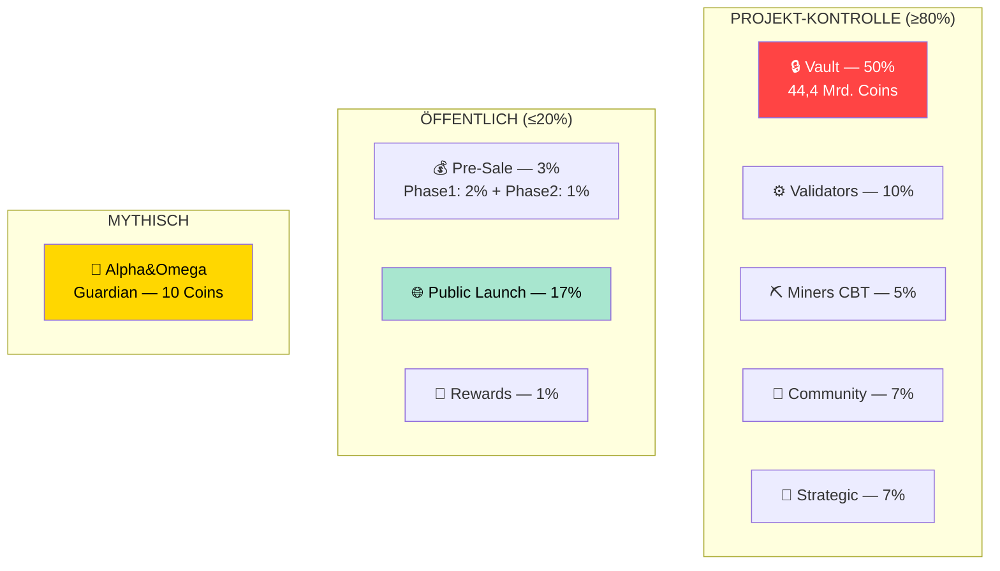
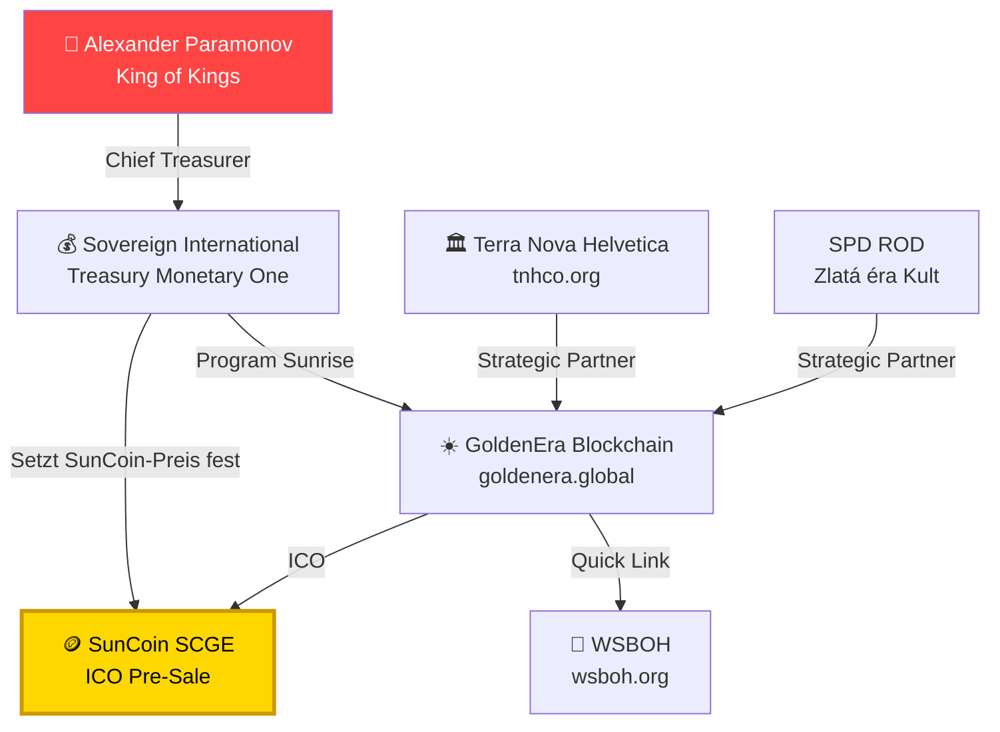

# GoldenEra.Global — Vollständiges Webarchiv & Whitepaper-Analyse

> **Stand:** 01.07.2026 | **Quelle:** https://goldenera.global + Whitepaper V1.3 (27.02.2026)  
> **Verlinkt:** [Kurz-Analyse](GOLDENERA_GLOBAL.md) · [Analyse-Index](ANALYSE_INDEX.md) · [Sun Coin](SUN_COIN_RECHERCHE.md)

---

## 🌐 Website-Struktur

```
goldenera.global/
├── /                   # Homepage — "Pillar of the New Global Financial Era"
├── /learn/             # Philosophy + Team/Partners
│   ├── #vision         # Asset-Backed Blockchain Intro
│   ├── #philosophy     # 10 Points of Project Philosophy
│   └── #team           # Strategic Partners & Collaborations
├── /participate/       # GoldenEra Ecosystem (nur Hero-Image, kein Text)
└── /wp-content/        # Whitepaper PDFs (WordPress)
```

**Technik:**
- Hosting: Hostinger Shared (lime-camel-749827.hostingersite.com)
- IP: 185.206.161.59 | DNS: exigo.ch (Schweiz)
- CMS: WordPress | SSL: Let's Encrypt
- Nur Englisch verfügbar

---

## 📄 Whitepaper V1.3 (27.02.2026) — Vollständige Inhaltsanalyse

### 1. Intro & Claims

| Claim | Reality-Check |
|-------|---------------|
| "20 years of global preparation" | Nicht verifizierbar — das Netzwerk existiert erst seit ~2020 |
| "200+ International Cooperatives" | Nur 5 namentlich genannt, alle aus dem Paramonov-Netzwerk |
| "Decentralised, asset-backed" | 50% der Coins in einer "Vault" = zentral kontrolliert |
| "Permissioned Proof of Work" | "Permissioned" = nicht dezentral, sondern kontrolliert |

### 2. SunCoin (SCGE) Tokenomics 🚨

| Parameter | Wert | Kritische Anmerkung |
|-----------|------|---------------------|
| **Total Supply** | **88.888.888.888** (88,9 Mrd.) | Extrem hoch — inflationär |
| **Pre-Minted** | **100%** | Alle Coins existieren ab Tag 1 |
| **Gold-Backing** | **0,25g pro Coin (25%)** | Whitepaper sagt selbst: "NOT fully backed" |
| **Initialpreis** | **$20,00 USD** | Festgelegt von "Sovereign Intl. Treasury M1" |
| **Implied Market Cap** | **$1,78 Billionen** | Größer als Bitcoin — für Hostinger-Projekt! |
| **Benötigtes Gold (25%)** | **22.222 Tonnen** | ~11% allen jemals geförderten Goldes |
| **Fiktive Währung** | **"USDB (US Dollar Basel III)"** | Existiert nicht — reine Erfindung |
| **Pre-Sale Phase 1** | "Fixed per contract" (2%) | Intransparent — Preis nicht öffentlich |
| **Pre-Sale Phase 2** | $15,00 (1%) | Q2 2026 |
| **Public Launch** | $20,00 (17%) | Q3 2026 |
| **Lockup** | **2 Jahre** | Klassisches Exit-Scam-Muster |

### 3. Token-Allokation



**⚠️ Kritisch:** 50% aller Coins liegen in einer "Vault" unter vollständiger Projektkontrolle. Zusammen mit Validators/Miners/Community/Strategic sind **über 80% der Coins nicht öffentlich handelbar** und unterliegen keiner unabhängigen Aufsicht.

### 4. Die 10 "Philosophy Points"

1. Money must reflect real, audited value
2. Restore financial integrity by anchoring to tangible resources
3. Support Sovereignty for nations
4. Cooperatives empowered for local economies
5. Individuals access stable financial tools
6. Decentralisation ensures fairness
7. Validator oversight adds integrity
8. Technology uplifts humanity
9. Part of Program Sunrise for peaceful global economy
10. Finance should serve people

**⚠️ Widerspruch:** Punkt 6 ("Decentralisation") vs. 50% Vault-Control + "Permissioned" Mining.

### 5. Das Ökosystem (11 Komponenten)

| Komponente | Kürzel | Status |
|------------|--------|--------|
| SunCoin | SCGE | ICO Pre-Sale |
| GoldenEra Wallet | GEW | Angekündigt |
| GoldenEra Scan | GES | Angekündigt (Explorer) |
| GoldenEra Exchange | GEX | Q3 2026 |
| SunChat | SCH | Angekündigt (Messenger!) |
| GoldenEra Marketplace | GEM | Angekündigt |
| GoldenEra Academy | GEA | Angekündigt |
| GoldenEra Innovation Hub | GEIH | Angekündigt |
| GoldenEra Charity | GEC | Angekündigt |
| SunPay Payment System | SunPay | Domain tot (sunpaym1.world NXDOMAIN) |
| RA Media | RAM | Angekündigt |

**Von 11 Komponenten ist KEINE EINZIGE operationell.** Nur der SunCoin ICO läuft — alles andere sind Versprechungen.

### 6. Zahlungsakzeptanz für ICO

Akzeptiert werden:
- **Krypto:** Bitcoin, Ethereum, USDT, USDC, DAI, wBTC, cbBTC
- **Fiat:** USD, EUR "und viele weitere" via Karte/Bank

**⚠️ Dies ist der Geldeinsammlungs-Mechanismus.** Investoren senden echte Kryptowährungen/Fiat und erhalten gesperrte SunCoins mit 2-Jahres-Lockup.

### 7. Technische Architektur

| Merkmal | Wert |
|---------|------|
| Typ | Account-based (kein UTXO) |
| Smart Contracts | **KEINE** |
| Konsens | Permissioned Proof of Work |
| State Storage | Merkle Patricia Trie |
| Governance | BIP (Blockchain Improvement Proposals) |
| Token Standard | Custom (nicht ERC-20 kompatibel) |
| Gebühren | 0,00000975 SCGE (typische TX) |

---

## 🔗 Verlinkte Domains — Status

| Domain | DNS | Website | Funktion |
|--------|-----|---------|----------|
| **wsboh.org** | ✅ Löst auf | 🟡 Erreichbar | World Sovereign Bank |
| **monetaryone.org** | ✅ Löst auf | 🔴 Nicht erreichbar | Monetary One |
| **ordrehospitaliers.world** | ❌ NXDOMAIN | 🔴 Existiert nicht | Order of Hospitallers |
| **sunpaym1.world** | ❌ NXDOMAIN | 🔴 Existiert nicht | SunPay Payment |
| **programsunrise.org** | ❌ Nicht registriert | 🔴 Existiert nicht | Program Sunrise Info |

**⚠️ 3 von 5 verlinkten Domains existieren nicht oder sind nicht erreichbar.** Das angebliche Payment-Gateway (SunPay) ist eine tote Domain.

---

## 🚨 Die 10 kritischsten Red Flags

| # | Red Flag | Erklärung |
|---|----------|-----------|
| 1 | **SunCoin NICHT vollständig goldgedeckt** | Whitepaper Seite 11: "actually NOT fully backed by physical assets" — Website behauptet "asset-backed" |
| 2 | **$1,78 Billionen Market Cap** | Größer als Bitcoin — für ein Hostinger-Free-Hosting-Projekt |
| 3 | **50% Vault-Control** | Die Hälfte aller Coins unter alleiniger Projekkontrolle |
| 4 | **2-Jahres-Lockup** | Investoren können 2 Jahre nicht verkaufen — Exit-Scam-Fenster |
| 5 | **88,9 Mrd. Pre-Mint** | Alle Coins ab Tag 1 existent — kein Mining nötig |
| 6 | **"USDB" existiert nicht** | Basel III hat keine Währung namens USDB geschaffen |
| 7 | **0 von 11 Komponenten funktionsfähig** | Nur der ICO ist "live" |
| 8 | **Payment-Gateway ist tote Domain** | sunpaym1.world = NXDOMAIN |
| 9 | **"Permissioned" = nicht dezentral** | Widerspricht dem Blockchain-Versprechen |
| 10 | **Keine Smart Contracts** | Ist eine reine Werttransfer-Kette — technisch trivial |

---

## 💰 Finanzmathematik des ICO

```
Total Supply:     88.888.888.888 SCGE
Pre-Sale (3%):     2.666.666.665 SCGE
  Phase 1 (2%):    1.777.777.777 × "fixed per contract" = ? (unbekannt)
  Phase 2 (1%):      888.888.888 × $15 = $13.333.333.320 max
Public (17%):     15.111.111.111 × $20 = $302.222.222.220 max

Maximales Fundraising (theoretisch): $315,5 Milliarden
Realistisches Fundraising (1% der Public): ~$3 Milliarden
```

**⚠️ Selbst $3 Milliären wären ein gigantischer Scam für ein Projekt ohne funktionierendes Produkt.**

---

## 📊 Verbindung zum TNHCO/Paramonov-Netzwerk



---

## 📋 Quellen

| # | Quelle | URL/Datei |
|---|--------|-----------|
| 1 | GoldenEra Homepage | https://goldenera.global |
| 2 | GoldenEra Learn | https://goldenera.global/learn/ |
| 3 | GoldenEra Participate | https://goldenera.global/participate/ |
| 4 | Whitepaper V1.3 | `/tmp/GoldenEra_Whitepaper.pdf` (7,1 MB) |
| 5 | DNS-Check | `dig goldenera.global` → 185.206.161.59, exigo.ch |
| 6 | Domain-Status | wsboh.org ✅ / monetaryone.org 🟡 / ordrehospitaliers.world ❌ / sunpaym1.world ❌ |
| 7 | Twitter/X | https://x.com/goldenera88888 |
| 8 | Telegram | https://t.me/GoldenEraBlockchain |

---

> **Verlinkt:** [Kurz-Analyse](GOLDENERA_GLOBAL.md) · [Analyse-Index](ANALYSE_INDEX.md) · [Sun Coin Recherche](SUN_COIN_RECHERCHE.md) · [Personen](../PERSONEN_VERFLECHTUNGEN.md)
