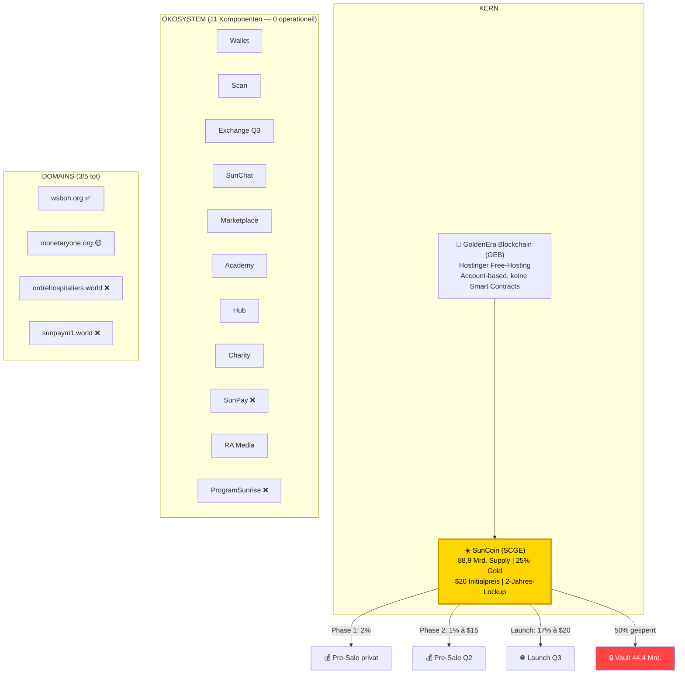
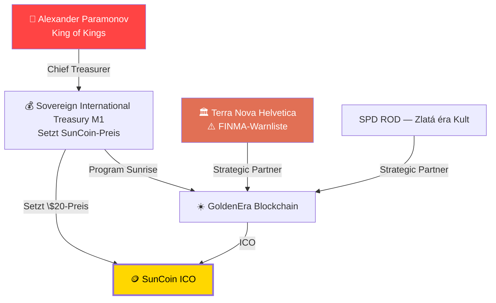

# GOLDENERA.GLOBAL — Vollständige Analyse (mit Whitepaper-Daten)

> **Stand:** 01.07.2026 | **Quellen:** Website goldenera.global + Whitepaper V1.3 (27.02.2026)  
> **Verlinkt:** [Analyse-Index](ANALYSE_INDEX.md) · [Personen](PERSONEN_VERFLECHTUNGEN.md) · [Sun Coin](SUN_COIN_RECHERCHE.md) · [Whitepaper DE](goldenera_raw/GoldenEra_Whitepaper_DE.md)

---

## 🚨 ZENTRALER FUND: SunCoin ICO Pre-Sale aktiv!

| Parameter | Wert |
|-----------|------|
| **Token-Name** | SunCoin (SCGE) |
| **Total Supply** | **88.888.888.888** (88,9 Mrd.) — 100% pre-minted |
| **Gold-Backing** | **25%** (0,25g pro Coin) — Whitepaper: *"NOT fully backed"* |
| **Initialpreis** | **$20,00 USD** — festgelegt von *Sovereign International Treasury Monetary One* |
| **Pre-Sale Phase 1** | 2%, Preis geheim ("fixed per contract") |
| **Pre-Sale Phase 2** | 1%, $15,00 (Q2 2026) |
| **Public Launch** | 17%, $20,00 (Q3 2026) |
| **Lockup** | **2 Jahre** |
| **Zahlungsmittel** | BTC, ETH, USDT, USDC, DAI, wBTC, cbBTC + Fiat |

---

## 📊 Ökosystem-Übersicht

---

## 💰 Tokenomics

### Allokation

| % | Menge | Empfänger | Kontrolle |
|---|-------|-----------|-----------|
| **50%** | 44,4 Mrd. | Vault – Savings of Coins | 🔒 Projekt |
| **10%** | 8,9 Mrd. | Validators | ⚙️ Projekt |
| **5%** | 4,4 Mrd. | Miners CBT Fund | ⛏️ Projekt |
| **7%** | 6,2 Mrd. | Community & Internal Ecosystem | 👥 Projekt |
| **7%** | 6,2 Mrd. | Strategical External Ecosystem | 🤝 Projekt |
| **3%** | 2,7 Mrd. | Pre-Sales | 💰 Investoren |
| **17%** | 15,1 Mrd. | Go Public – Launch | 🌐 Öffentlich |
| **1%** | 889 Mio. | Rewards & Bonus | 🎁 Marketing |

**⚠️ 79% aller Coins unter Projektkontrolle.**

### ICO-Phasen

| Phase | Coins | Preis | Lockup |
|-------|-------|-------|--------|
| Phase 1 (privat) | 1,78 Mrd. | Geheim | 2 Jahre |
| Phase 2 (öffentlich) | 889 Mio. | $15 | 2 Jahre (25% nach Jahr 1) |
| Public Launch | 15,1 Mrd. | $20 | Kein Lockup |

### Finanzmathematik

- **Implied Market Cap:** 88,9 Mrd. × $20 = **$1,78 Billionen**
- **Max. Fundraising:** Phase 2 $13,3 Mrd. + Launch $302 Mrd.
- **Gold für 25% Deckung:** 22.222 Tonnen (~11% allen jemals geförderten Goldes)

---

## 🔗 Verbindung zum Paramonov-Netzwerk

---

## 🏗️ Technische Architektur

| Merkmal | Wert | Kritik |
|---------|------|--------|
| Typ | Account-based | Standard |
| Smart Contracts | **KEINE** | Nur Werttransfer |
| Konsens | Permissioned PoW | Zentral kontrolliert |
| Token Standard | Custom (nicht ERC-20) | Keine Interoperabilität |
| Mining | Validator-Liste | Nicht dezentral |
| Governance | BIP-System | Kopie von Bitcoin |

---

## 🔗 Domain-Status

| Domain | Status |
|--------|--------|
| wsboh.org | ✅ Erreichbar |
| monetaryone.org | 🟡 DNS nur |
| ordrehospitaliers.world | ❌ NXDOMAIN |
| sunpaym1.world | ❌ NXDOMAIN |
| programsunrise.org | ❌ Nicht registriert |

**3 von 5 Domains existieren nicht.**

---

## 👥 Strategische Partner

| Partner | Realität |
|---------|----------|
| World Sovereign Bank of Hospitallers | Keine Banklizenz |
| Light Great Rus | Keine Registrierung |
| SPD ROD | = Zlatá éra Kult |
| People's Light | Keine Registrierung |
| **Terra Nova Helvetica** | **FINMA-Warnliste!** |
| "200 Cooperatives" | Keine einzige genannt |

---

## 🚨 Die 12 kritischsten Red Flags

| # | Red Flag | Beleg |
|---|----------|-------|
| 1 | **NICHT vollständig goldgedeckt** | Whitepaper: *"NOT fully backed"* |
| 2 | **$1,78 Bio. Market Cap** | Für Hostinger-Free-Projekt |
| 3 | **79% Projekt-Kontrolle** | 50% Vault + 29% Projekt-Pools |
| 4 | **2-Jahres-Lockup** | Exit-Scam-Fenster |
| 5 | **88,9 Mrd. Pre-Mint** | Kein Mining-Mechanismus |
| 6 | **"USDB" existiert nicht** | Basel III ≠ Währung |
| 7 | **0/11 Komponenten live** | Nur ICO funktioniert |
| 8 | **Payment-Gateway tot** | sunpaym1.world = NXDOMAIN |
| 9 | **"Permissioned" = zentral** | Widerspricht "dezentral" |
| 10 | **Keine Smart Contracts** | Technisch trivial |
| 11 | **Kein Team/Impressum** | Null reale Personen |
| 12 | **"200 Cooperatives" Phantom** | Keine einzige genannt |

---

## 🚨 Fazit

> **GoldenEra.global ist ein aktiver Krypto-ICO-Scam.** Null funktionierende Produkte, tote Domains, fiktive Währungen, zentralisierte Token-Kontrolle, 2-Jahres-Lockup. Die Verbindung zum Paramonov/TNHCO-Netzwerk ist durch Partnerliste und Preissetzer (Sovereign International Treasury Monetary One) eindeutig. Dies ist die Monetarisierungsphase eines jahrelang aufgebauten Finanzkult-Ökosystems.

---

> **Quellen:** [Whitepaper EN](goldenera_raw/GoldenEra_Whitepaper.md) · [Whitepaper DE](goldenera_raw/GoldenEra_Whitepaper_DE.md) · [Whitepaper PDF](goldenera_raw/GoldenEra_Whitepaper.pdf)
