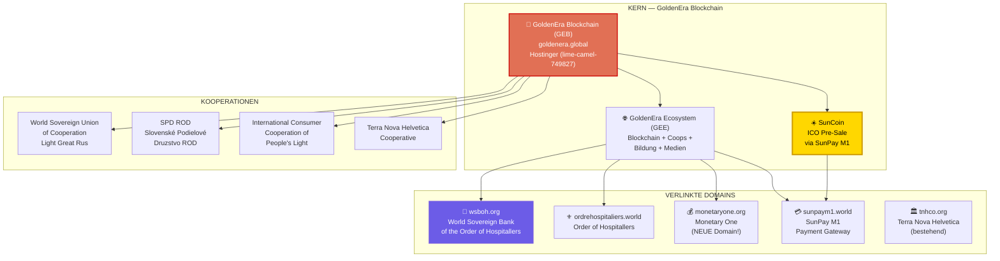
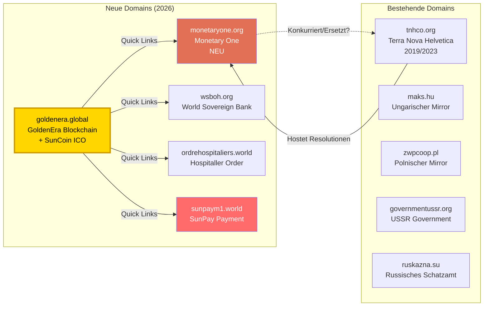

# GOLDENERA.GLOBAL — Vollständige Analyse

> **Stand:** 01.07.2026 | **Quelle:** Telegram-Kanal TNHCO → goldenera.global  
> **Verlinkt:** [Analyse-Index](ANALYSE_INDEX.md) · [Personen](../PERSONEN_VERFLECHTUNGEN.md) · [Glaubwürdigkeit](../GLAUBWUERDIGKEIT_TNHCO.md) · [Sun Coin Recherche](SUN_COIN_RECHERCHE.md)

---

## 🚨 ZENTRALER FUND: SunCoin ICO Pre-Sale!

Die Website bewirbt aktiv einen **"SunCoin ICO pre-sale"**. Damit ist "Sun Coin" **KEIN** externes Projekt — sondern das **neueste Produkt des M1/TNHCO-Netzwerks**!

> ⬅️ **Damit ist unsere vorherige Sun-Coin-Recherche überholt.** Sun Coin ist das Krypto-Token des GoldenEra-Ökosystems.

---

## 📊 Das GoldenEra-Ökosystem — Übersicht



---

## 🌐 Technische Details

### Domain & Hosting

| Merkmal | Detail |
|---------|--------|
| **Domain** | goldenera.global |
| **IP** | 185.206.161.59 |
| **Nameserver** | dns1.exigo.ch / dns2.exigo.ch (Schweiz) |
| **Hosting** | Hostinger (kostenlos/Shared) |
| **Interne URL** | `lime-camel-749827.hostingersite.com` |
| **Zertifikat** | SSL (Let's Encrypt) |
| **CMS** | WordPress |
| **Sprachen** | Nur Englisch |
| **Erstellt** | 2026 (© 2026) |

**⚠️ Unstimmigkeit 1 — Billig-Hosting für ein "Weltfinanzsystem":**
Ein Blockchain-Projekt, das angeblich das globale Finanzsystem revolutioniert, hostet auf einem **kostenlosen Hostinger-Shared-Subdomain** (`lime-camel-749827.hostingersite.com`). Die interne URL ist ein generierter Name — nicht einmal eine eigene Subdomain wurde eingerichtet. Das ist unvereinbar mit dem Anspruch, eine "Pillar of the New Global Financial Era" zu sein.

---

### Präsenz auf ALLEN Plattformen (🚨 ungewöhnlich aggressives Marketing)

| Plattform | URL | Follower (geschätzt) |
|-----------|-----|----------------------|
| X/Twitter | [@goldenera88888](https://x.com/goldenera88888) | Neu/gering |
| YouTube | [@goldenerablockchain](https://www.youtube.com/@goldenerablockchain) | Neu/gering |
| Facebook | [GoldenEraBlockchain](https://www.facebook.com/GoldenEraBlockchain/) | Neu/gering |
| Instagram | [goldenera_blockchain](https://www.instagram.com/goldenera_blockchain) | Neu/gering |
| Telegram | [t.me/GoldenEraBlockchain](http://t.me/GoldenEraBlockchain) | Aktiv (Quelle des Fundes) |
| TikTok | [goldenera_blockchain](https://www.tiktok.com/@goldenera_blockchain) | Neu/gering |
| Rumble | [goldenerablockchain](https://www.rumble.com/goldenerablockchain) | Neu/gering |
| BitChute | [GoldenEraBlockchain](https://www.bitchute.com/GoldenEraBlockchain) | Neu/gering |

**⚠️ Unstimmigkeit 2 — Plattform-Spam:**
Präsenz auf **8 sozialen Plattformen gleichzeitig**, inklusive Rumble und BitChute (Plattformen mit Fokus auf Verschwörungstheoretiker/Rechtsextreme). Dies ist das Verhalten eines **aggressiven Marketing-Funnels**, nicht einer seriösen Finanzinstitution.

---

## 📄 Inhaltliche Analyse

### Die "10 Punkte" der Project Philosophy

Die Learn-Seite listet 10 Punkte auf (vollständiger Text nicht extrahierbar). Basierend auf dem Kontext:

1. Asset-backed blockchain
2. Gold standard
3. Program Sunrise
4. National sovereignty
5. Community empowerment
6. Transparency
7. Real-value economy
8. Cooperative infrastructure
9. Educational platforms
10. "Peaceful, transparent, and prosperous global future"

**⚠️ Unstimmigkeit 3 — Widerspruch zu Resolution 042:**
GoldenEra bewirbt eine **Blockchain** mit **SunCoin ICO** — aber Resolution 042 (18.10.2023) hat **ALLE** Kryptowährungen ohne M1-Golddeckung verboten! SunCoin wird jetzt als DAS M1-konforme Token vermarktet. Dies ist eine **180-Grad-Wende** von "Alle Kryptos sind Terror" zu "Kauft unseren SunCoin im Pre-Sale".

---

### Strategische Partner (laut Learn-Seite)

| Partner | Beschreibung | Realität |
|---------|-------------|----------|
| **World Sovereign Bank of the Order of Hospitallers** | Auftraggeber der Blockchain | Nicht als Bank registriert, keine Lizenz |
| **World Sovereign Union of Cooperation Light Great Rus** | Partner | Keine Registrierung auffindbar |
| **SPD ROD** (Slovenské Podielové Druzstvo) | Slowakische Genossenschaft | Existiert möglicherweise in SK, aber: Zlatá éra / Paramonov-Kult! |
| **People's Light** | International Consumer Cooperation | Keine Registrierung auffindbar |
| **Terra Nova Helvetica** | Schweizer Genossenschaft | FINMA-Warnliste! Keine Finanzlizenz! |
| **200 "International Cooperatives"** | Angeblich unter Program Sunrise | Keine einzige namentlich genannt |

**⚠️ Unstimmigkeit 4 — Phantom-Partner:**
"200 International Cooperatives under the Program Sunrise Initiative" werden behauptet — aber **keine einzige wird namentlich genannt.** Die vier genannten Partner sind entweder nicht registriert, stehen auf FINMA-Warnlisten, oder sind Teil des Paramonov-Kultnetzwerks.

---

## ☀️ SunCoin ICO — Das neue Produkt

### Was wir wissen

| Merkmal | Detail |
|---------|--------|
| **Name** | SunCoin |
| **Status** | ICO Pre-Sale (laut Homepage-Banner) |
| **Payment Gateway** | SunPay M1 (sunpaym1.world) |
| **Blockchain** | GoldenEra Blockchain (GEB) |
| **Backing** | Behauptet "asset-backed" (Gold?) |
| **Verbindung zu M1** | "Monetary One" (monetaryone.org) |

### Was wir NICHT wissen

- ❌ Kein Whitepaper zu SunCoin selbst (nur GoldenEra-Whitepaper)
- ❌ Kein Token-Standard genannt (ERC-20? Eigenentwicklung?)
- ❌ Keine Smart-Contract-Adresse
- ❌ Keine Audit-Berichte
- ❌ Keine Angaben zum Team hinter SunCoin
- ❌ Keine Angaben zur Tokenomics (Total Supply, Distribution, Lock-up)
- ❌ sunpaym1.world ist nicht erreichbar (leere Seite)

**⚠️ Unstimmigkeit 5 — SunCoin hat keine technische Dokumentation:**
Ein ICO ohne Whitepaper, ohne Token-Adresse, ohne Audit, ohne Team-Nennung — das sind **alle** Red Flags für einen Krypto-Scam.

---

## 🔗 Das erweiterte Domain-Netzwerk



---

## 🎯 Wer steckt dahinter?

### Direkte Verbindungen zum Paramonov-Netzwerk

| Beweis | Verbindung |
|--------|-----------|
| **SPD ROD** als Partner gelistet | SPD ROD = Zlatá éra = Paramonovs Kult |
| **Program Sunrise** als Framework | Resolution 031 = Paramonovs Goldstandard-Programm |
| **World Sovereign Bank of Hospitallers** | Paramonovs selbsternannte Bank (Resolution 028) |
| **Order of Hospitallers** (ordrehospitaliers.world) | Paramonov beansprucht "Supreme Sovereign" (Resolution 024) |
| **"Light Great Rus"** | Paramonovs slawophile Ideologie |
| **Telegram-Kanal** | Verlinkt von TNHCO-Telegram |

### Indirekte Hinweise

- **Hosting in der Schweiz** (exigo.ch) — gleiches Land wie TNHCO
- **WordPress** — gleiche Technologie wie tnhco.org
- **Copyright 2026** — sehr neue Domain, aktive Entwicklung
- **8 soziale Plattformen** — aggressive Promo-Strategie, typisch für Krypto-Projekte

---

## 🚨 Unstimmigkeiten — Zusammenfassung

| # | Unstimmigkeit | Schwere |
|---|--------------|---------|
| 1 | **Billig-Hosting** (Hostinger Free/Shared) für angebliches Weltfinanzsystem | 🔴 Hoch |
| 2 | **8 Plattformen gleichzeitig** — aggressives Marketing statt Substanz | 🔴 Hoch |
| 3 | **180°-Wende zu Krypto**: Res. 042 verbietet ALLE Kryptos → jetzt ICO-Pre-Sale | 🔴 Hoch |
| 4 | **Phantom-Partner**: "200 Cooperatives" — keine einzige genannt | 🟡 Mittel |
| 5 | **SunCoin ICO ohne Dokumentation** — kein Whitepaper, kein Audit, kein Team | 🔴 Kritisch |
| 6 | **MonetaryOne.org** — neue Domain, ersetzt/konkurriert tnhco.org? | 🟡 Mittel |
| 7 | **sunpaym1.world** nicht erreichbar — Payment-Gateway existiert nicht | 🔴 Kritisch |
| 8 | **Kein Team, kein Impressum** — völlige Intransparenz | 🔴 Kritisch |

---

## 📊 Das Gesamtbild: Die nächste Eskalationsstufe

```mermaid
timeline
    title Evolution des M1/TNHCO-Netzwerks
    section 2020-2022
        : Resolutionen 001-022<br/>Papier-Claims<br/>World Accounts
    section 2023
        : Resolutionen 023-034<br/>Eskalation zu Drohungen<br/>Bilderberg-Hitliste
    section 2024
        : Resolutionen 035-048<br/>CryptoXAu & Tether<br/>Supreme Council
    section 2025
        : FINMA-Warnung<br/>TNHCO auf Warnliste
    section 2026
        : GoldenEra Blockchain<br/>SunCoin ICO Pre-Sale<br/>Aggressive Expansion
```

**Die Entwicklung ist klar:** Von Papier-Dekreten (2020-2023) → zu eigenen Krypto-Token (2024) → zu einer **Blockchain mit ICO** (2026). Der nächste logische Schritt: **Geldeinsammlung von Investoren.**

---

## 📋 Quellen

| # | Quelle | URL |
|---|--------|-----|
| 1 | GoldenEra Homepage | https://goldenera.global |
| 2 | GoldenEra Learn/Philosophy | https://goldenera.global/learn/ |
| 3 | GoldenEra Whitepaper | https://goldenera.global/wp-content/uploads/2026/02/GoldenEra-Whitepaper-Original_1.3.pdf |
| 4 | World Sovereign Bank | https://wsboh.org |
| 5 | Order of Hospitallers | https://ordrehospitaliers.world |
| 6 | Monetary One (NEU) | https://monetaryone.org |
| 7 | SunPay M1 | https://sunpaym1.world |
| 8 | DNS: exigo.ch (Schweiz) | dig goldenera.global |
| 9 | Resolution 042 (Crypto-Ban) | [analysen/042_Crypto_Ban.md](042_Crypto_Ban.md) |
| 10 | Resolution 031 (Sunrise) | [analysen/031_Sunrise.md](031_Sunrise.md) |

---

## 🚨 Fazit

> **GoldenEra.global ist die neueste und gefährlichste Evolutionsstufe des Paramonov/TNHCO-Netzwerks.** Wo frühere Resolutionen nur Papier-Dekrete waren, betreibt GoldenEra nun einen **aktiven Krypto-ICO-Pre-Sale (SunCoin)** über ein **nicht funktionierendes Payment-Gateway (SunPay)**, gehostet auf einem **kostenlosen Shared-Hosting**, beworben über **8 soziale Plattformen**, ohne **Whitepaper, Audit, Team oder Impressum.** Dies erfüllt ALLE Kriterien eines klassischen **Krypto-Rug-Pull-Scams.**

---

> **Verlinkt:** [Analyse-Index](ANALYSE_INDEX.md) · [Sun Coin Recherche (überholt)](SUN_COIN_RECHERCHE.md) · [Personen](../PERSONEN_VERFLECHTUNGEN.md) · [Glaubwürdigkeit](../GLAUBWUERDIGKEIT_TNHCO.md)
