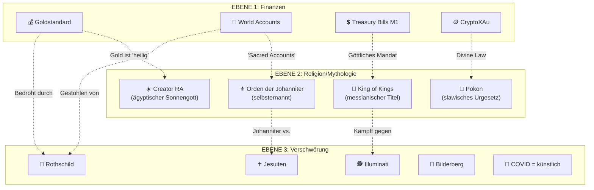

# THEMEN-VERMISCHUNG — Wie Finanzen, Religion und Verschwörung verschmelzen

> **Stand:** 2026-07-01  
> **Verlinkt:** [Analyse-Index](ANALYSE_INDEX.md) · [Ungereimtheiten](UNGEREIMTHEITEN.md) · [Geldsystem-Paradox](GELDSYSTEM_PARADOX.md)

---

## 🔀 Die drei Ebenen der Vermischung

---

## 📊 Analyse der Vermischung nach Resolution

| Resolution | Finanzen | Religion | Verschwörung | Vermischungsgrad |
|------------|----------|----------|-------------|-------------------|
| 001 | ✅ Goldstandard | — | — | 🟢 Gering |
| 004 | ✅ Assets | ✅ "Gott der Allmächtige" | — | 🟡 Mittel |
| 006 | ✅ TB M1, World Accounts | — | — | 🟢 Gering |
| 009 | ✅ Finanzkrise | — | ✅ COVID = künstlich | 🟡 Mittel |
| 010 | — | ✅ King of Kings, Creator RA | — | 🔴 Hoch |
| 011 | ✅ Rothschild-Assets | — | ✅ Rothschild = kriminell | 🟡 Mittel |
| 018 | ✅ Fed, IMF | — | ✅ Illuminati, 5 Eyes | 🟡 Mittel |
| 024 | ✅ Banksystem | ✅ Johanniter-Orden | ✅ Jesuiten, Illuminati, Lucifer | 🔴 Hoch |
| 028 | ✅ Goldstandard | ✅ "Sacred Gold" | — | 🟡 Mittel |
| 031 | ✅ Sunrise-Programm | — | — | 🟢 Gering |
| 032 | ✅ Rechtssystem | ✅ Pokon (Urgesetz) | — | 🟡 Mittel |
| 034 | ✅ Asset-Konfiskation | — | ✅ Bilderberg = terroristisch | 🔴 Hoch |
| 042 | ✅ Crypto-Verbot | ✅ "Divine Law" | ✅ US/China = "false governments" | 🔴 Hoch |
| 042-1 | ✅ CryptoXAu | ✅ "Divine Armadas" | — | 🟡 Mittel |
| 044 | ✅ Tether-Verbot | — | ✅ Tether = terroristisch | 🟡 Mittel |

---

## 🔍 Warum diese Vermischung?

### 1. Psychologische Strategie
Die Vermischung von Finanzen, Religion und Verschwörung ist kein Zufall, sondern eine **bewusste rhetorische Strategie**:

- **Finanzielle Claims** (Goldstandard, World Accounts) sprechen Menschen mit finanziellen Sorgen an
- **Religiöse Sprache** (Creator RA, King of Kings, Divine Law) verleiht den Claims eine transzendente Autorität, die nicht hinterfragt werden darf
- **Verschwörungsnarrative** (Rothschild, Illuminati, Bilderberg) schaffen ein klares Feindbild und erklären, warum das System noch nicht funktioniert

### 2. Immunisierung gegen Kritik
Durch die religiöse Aufladung wird jede Kritik zur **Blasphemie**:

> "Diese Resolution basiert auf dem **Göttlichen Schöpfungsgesetz**, das über allen irdischen Gesetzen steht." (Res. 024, 042)

→ Wer widerspricht, widerspricht nicht Paramonov, sondern **Gott**. Das macht rationale Diskussion unmöglich.

### 3. Unangreifbare Legitimation
Indem Paramonov sich als **"King of Kings"** und **"White Spiritual Boy"** bezeichnet, schafft er eine Position **außerhalb jeder rechtlichen Überprüfbarkeit**:

- Er ist nicht CEO einer Firma → er ist **Monarch von Gottes Gnaden**
- Er bietet nicht Finanzprodukte an → er vollstreckt **Göttliches Gesetz**
- Seine Dokumente sind nicht Verträge → sie sind **Heilige Dekrete**

---

## ⚠️ Warnsignale der Vermischung

| Warnsignal | Bedeutung |
|------------|-----------|
| Finanzprodukte + religiöse Terminologie | Klassisches Merkmal von **Finanzkulten** |
| "Divine Law" über irdischem Recht | **Rechtliche Immunisierungsstrategie** |
| Persönliche Titel ("King of Kings") | **Personenkult** |
| Juden/Jesuiten/Illuminati als Feindbild | **Antisemitische Codes** (Rothschild, Jesuiten, "Luciferian centers") |
| COVID als "künstliche Pandemie" | **Wissenschaftsfeindlichkeit** als Einstieg in geschlossenes Weltbild |
| "Nur wir können das System retten" | **Exklusivitätsanspruch** — typisch für Sekten |

---

## 📋 Fazit

Die TNHCO/M1-Dokumente vermischen **bewusst und systematisch** drei normalerweise getrennte Sphären:

1. **Finanzen** geben den Anschein von Seriosität
2. **Religion** verleiht unangreifbare Autorität
3. **Verschwörung** erklärt, warum das System (noch) nicht anerkannt ist

Diese Kombination ist das **Markenzeichen eines Finanzkults** — nicht einer legitimen Finanzinstitution.

---

> **Verlinkt:** [Analyse-Index](ANALYSE_INDEX.md) · [Ungereimtheiten](UNGEREIMTHEITEN.md) · [Geldsystem-Paradox](GELDSYSTEM_PARADOX.md)
