# UNGEREIMTHEITEN — Widersprüche, fehlende Beweise, logische Brüche

> **Stand:** 2026-07-01 | **Basierend auf:** 48 Resolutionen, 34 Hatarozat, 18 Webseiten  
> **Verlinkt:** [Analyse-Index](ANALYSE_INDEX.md) · [Themen-Vermischung](THEMEN_VERMISCHUNG.md) · [Geldsystem-Paradox](GELDSYSTEM_PARADOX.md)

---

## 🚨 1. Fehlende Beweise — Das zentrale Problem

### Behauptung vs. Beleg

**Keine einzige der 48 Resolutionen enthält verifizierbare Beweise.** Alle Behauptungen ruhen auf:

| Behauptungstyp | Beispiel | Was fehlt |
|---------------|----------|-----------|
| **Besitzansprüche** | "M1 ist Halter und Verwalter des gesamten Weltgoldes" (Res. 001) | Kein Audit, kein Banknachweis, kein Goldzertifikat |
| **Kontonummern** | World Account `01-00-01-4-AAA-777-C3-AM-01` (Res. 004) | Keine Bankbestätigung, kein Kontoauszug |
| **UN-Registrierung** | UN No. 509519 / 521730 (wechselnd) | Keine UN-Bestätigung; Nummern nicht im UN-Register auffindbar |
| **LEI-Nummer** | 2534008YC6NRP4BLQF15 | GLEIF-Datenbank zeigt inaktiven/keinen Eintrag |
| **Goldmenge** | "1 Mrd. Gold Dollar = 1000t Gold" (Res. 042-1) | Kein physischer Goldnachweis, kein Lagerort |
| **Kredite** | "170 Mrd. ECU an 86 Länder" (Res. 018) | Keine Kreditverträge, keine Länder bestätigen dies |
| **SDR-Zuteilung** | "6 Billionen XAU SDR" (Res. 018) | IMF bestätigt keine solche Zuteilung |

---

## 🔀 2. Interne Widersprüche zwischen Resolutionen

### Widerspruch 1: UN-Nummer wechselt

| Resolution | UN-Nummer |
|------------|-----------|
| 001, 006 | UN No. **521730** |
| 009, 010, 011, 018 | UN No. **509519** |

**Frage:** Welche ist die "echte"? Warum wechselt sie? Ein und dieselbe Organisation kann nicht zwei UN-Nummern haben.

---

### Widerspruch 2: Wo liegen die World Accounts?

| Resolution | Ort der Konten |
|------------|----------------|
| 004, 006, 009, 018, 024 | **WORLD BANK** |
| 028, 031, 034, 042 | **World Sovereign Bank of the Order Hospitallers** |

**Frage:** Wurden die Konten transferiert? Wenn ja, wann und mit welcher Rechtsgrundlage? Die Resolutionen erwähnen keinen Transfer — die Bank wechselt einfach stillschweigend.

---

### Widerspruch 3: Paramonovs Titel eskalieren

| Resolution | Titel |
|------------|-------|
| 001 (04.2020) | "H.E. Alexander N. Paramonov, Chief Treasurer" |
| 006 (09.2021) | "His Highness Alexander Nikolaevich Paramonov" |
| 010 (01.2022) | "His Majesty, **King of Kings**, Alexander Nikolaevich Paramonov" |
| 018 (07.2022) | "His Majesty Alexander" (Patronym verschwunden) |
| 024 (12.2022) | "Alexander, **The King of Kings, White Spiritual Boy**, Supreme Sovereign" |
| 042 (10.2023) | Fügt "Grand Intendant of the Sovereign Order" hinzu |

**Frage:** Wer hat Paramonov gekrönt? Resolution 010 dankt "Custodians" und "Sovereigns" — aber keine Namen, keine Zeremonie, kein Datum der Krönung.

---

### Widerspruch 4: Goldstandard — Hilfe oder Zwang?

| Resolution | Tonfall |
|------------|---------|
| 001, 006, 031 | Länder werden **eingeladen**, dem Goldstandard beizutreten. "Partnerländer" |
| 024, 028, 042 | Länder die nicht beitreten werden **annektiert**, als "kriminell" deklariert |

**Frage:** Ist der M1-Goldstandard eine Einladung oder eine Drohung? Die Rhetorik wechselt fundamental.

---

### Widerspruch 5: Wer ist "White Spiritual Boy"?

| Resolution | Bedeutung |
|------------|-----------|
| 001, 004, 006 | Eine **Organisation**: "White Spiritual Boy R.S.B. Global Corp Inc" |
| 010, 018, 024, 031, 042 | Eine **Person**: Paramonov selbst unterschreibt ALS "White Spiritual Boy" |

**Frage:** Ist "White Spiritual Boy" eine Firma ODER ein Titel von Paramonov? Beides gleichzeitig ist logisch inkonsistent.

---

### Widerspruch 6: Fiat-Geld wird verdammt — aber ECU ist M1-Währung

| Resolution | Aussage |
|------------|---------|
| 006, 009, 042 | Alle Fiat-Währungen sind kriminell, müssen eliminiert werden |
| 001, 006, 042 | ECU ist eine der drei M1-Reservewährungen (1 ECU = 1 oz Gold) |

**Frage:** Die **ECU** (European Currency Unit) war der Vorläufer des Euro und existierte von 1979-1998 als **reine Korbwährung ohne physische Form** — also genau das, was M1 als "Fiat-Geld" verdammt. Warum verwendet M1 ausgerechnet eine nicht mehr existierende Fiat-Währung als "goldgedeckt"?

---

### Widerspruch 7: USSR existiert — oder nicht?

| Resolution | Aussage zur USSR |
|------------|------------------|
| 001 | "Golden Soviet Ruble" als Währung — impliziert existierende Autorität |
| 024 | USSR (in Grenzen von 1945) ist das **einzige** legitime souveräne Land |
| 042 | USSR ist Mitglied des "Supreme Council" |

**Frage:** Die USSR wurde 1991 aufgelöst. Wo ist ihr Regierungssitz? Wer vertritt sie? Wie kann ein nicht-existierender Staat Mitglied eines "Supreme Council" sein?

---

## 📊 3. Muster der Eskalation

```mermaid
graph LR
    subgraph "2020: Finanzielle Vision"
        R1["001: Anti-Krisen-Maßnahmen<br/>Goldstandard vorgeschlagen"]
    end
    subgraph "2021: Besitzansprüche"
        R4["004: Historische Assets<br/>annulliert"]
        R6["006: World Accounts<br/>beansprucht"]
    end
    subgraph "2022: Persönliche Macht"
        R10["010: King of Kings<br/>Selbstkrönung"]
        R11["011: Rothschild<br/>zum Feind erklärt"]
    end
    subgraph "2023-2025: Totalitäre Drohungen"
        R24["024: Alle Länder illegal"]
        R34["034: 120+ Personen<br/>namentlich angeklagt"]
        R42["042: Weltherrschaft<br/>über Grundbesitz"]
    end
    R1 --> R4 --> R6 --> R10 --> R11 --> R24 --> R34 --> R42

    style R1 fill:#a8e6cf,color:#000
    style R4 fill:#ffd700,color:#000
    style R6 fill:#ffd700,color:#000
    style R10 fill:#ff6b6b,color:#fff
    style R11 fill:#ff6b6b,color:#fff
    style R24 fill:#ff4444,color:#fff
    style R34 fill:#ff4444,color:#fff
    style R42 fill:#b71c1c,color:#fff
```

**Kernproblem:** Die Dokumenten-Reihe zeigt eine klare **Radikalisierungsspirale** — von scheinbar seriösen Finanzvorschlägen (2020) zu totalitären Weltherrschaftsansprüchen mit Todesdrohungen (2023-2025).

---

## 🔍 4. Plausibilitäts-Check konkreter Claims

| Claim | Plausibilität | Begründung |
|-------|---------------|------------|
| "M1 hält alles Weltgold" | ❌ Unplausibel | Weltgoldreserven: ~35.000t. Wert: ~$2,5 Bio. Kein Land hat seinen Goldbestand an M1 übertragen. |
| "World Accounts in 172 Ländern" | ❌ Unplausibel | Keine Bank hat diese Kontonummern je bestätigt. Format entspricht keinem IBAN/SWIFT-Standard. |
| "Googol-Note" (10^100) | ❌ Absurd | Ein Googol übersteigt die Anzahl der Atome im Universum. Keine sinnvolle Währungseinheit. |
| "Centillion-Note" (10^303) | ❌ Absurd | Wie Googol — rein mathematische Spielerei. |
| "AI kontrolliert Finanzsystem" | ❌ Unbelegt | Welche AI? Wer hat sie programmiert? Keine Details. |
| "Bilderberg = kriminelle Vereinigung" | ❌ Subjektiv | Bilderberg ist ein privates Diskussionsforum. Kein Gericht hat es als kriminell eingestuft. |
| "Jesuiten/Illuminati steuern Welt" | ❌ Verschwörungstheorie | Klassische antisemitische/antikatholische Codes. Keine Beweise. |
| "Rothschild kontrolliert Weltbanken" | ❌ Verschwörungstheorie | Die Rothschild-Familie ist eine Bankiersfamilie, kontrolliert aber nicht das Weltfinanzsystem. |

---

## 📋 5. Zusammenfassung der Prüfkriterien

| Kriterium | Erfüllt? |
|-----------|----------|
| Enthalten die Dokumente verifizierbare Beweise? | ❌ NEIN |
| Sind die Behauptungen untereinander konsistent? | ❌ NEIN (7 dokumentierte Widersprüche) |
| Gibt es externe Bestätigung der Claims? | ❌ NEIN (keine Bank, kein Land, keine UN bestätigt) |
| Sind die Autoren rechtlich legitimiert? | ❌ NEIN (keine Rechtsgrundlage erkennbar) |
| Folgen die Dokumente einer nachvollziehbaren Logik? | ⚠️ TEILWEISE (interne Logik, aber externe Absurdität) |
| Gibt es reale geschäftliche Aktivität? | ⚠️ UNKLAR (TNHCO-Website existiert, aber keine belegten Transaktionen) |

---

> **Verlinkt:** [Analyse-Index](ANALYSE_INDEX.md) · [Themen-Vermischung](THEMEN_VERMISCHUNG.md) · [Geldsystem-Paradox](GELDSYSTEM_PARADOX.md)
