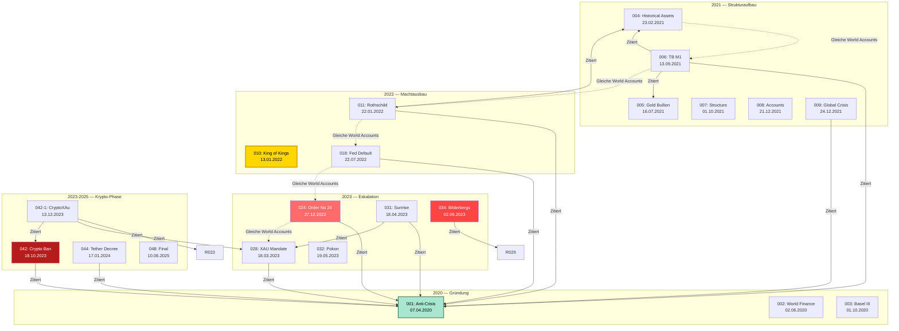
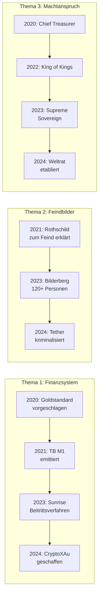

# VERFLECHTUNGSGRAPH — Dokumenten-Referenzen & Abhängigkeiten

> **Stand:** 2026-07-01  
> **Verlinkt:** [Analyse-Index](ANALYSE_INDEX.md) · [Ungereimtheiten](UNGEREIMTHEITEN.md)

---

## 📊 Gesamtgraph aller Resolutionen

---

## 🔗 Referenz-Matrix

| Resolution | Zitiert folgende frühere Resolutionen |
|------------|--------------------------------------|
| 001 | — (Erstes Dokument) |
| 002 | 001 |
| 003 | 001, 002 |
| 004 | 001 |
| 005 | — (OCR fehlgeschlagen) |
| 006 | 001, 004, 005 |
| 007 | 001-006 |
| 008 | 001-007 |
| 009 | 001, 004 |
| 010 | — (Keine Zitate) |
| 011 | 001, 004 |
| 012-017 | 001, 004, 006, 011 |
| 018 | 001, 017 |
| 019-022 | 001, 018 |
| 023-030 | 001, 004, 006, 018 |
| 031 | 001, 019, 028 |
| 032 | 001, 028 |
| 033 | 001, 029 |
| 034 | 029 |
| 035-041 | 001, 028, 031 |
| 042 | 001, 019 |
| 042-1 | 023, 028, 042, 043 |
| 043 | 001, 028 |
| 044 | 001 |
| 045-048 | 001, 031, 042 |

---

## 📈 Muster in den Referenzen

### "Resolution 001" als Ur-Text
**24 von 48 Resolutionen** zitieren Resolution 001 als Grundlage. 001 fungiert damit als eine Art "Verfassung" des M1-Universums.

### Fehlende Querverweise
Resolutionen **010** (King of Kings) und **034** (Bilderbergs) zitieren fast keine anderen Resolutionen — sie sind rhetorische Deklarationen, keine aufbauenden Dokumente.

### Zirkelschluss
Alle Referenzen verweisen NUR auf andere M1-Dokumente. Keine einzige Resolution zitiert:
- Ein tatsächliches Gesetz
- Ein Gerichtsurteil
- Einen unabhängigen Auditbericht
- Eine externe Quelle

---

## 📊 Thematische Entwicklung

---

> **Verlinkt:** [Analyse-Index](ANALYSE_INDEX.md) · [Ungereimtheiten](UNGEREIMTHEITEN.md) · [Themen-Vermischung](THEMEN_VERMISCHUNG.md)
